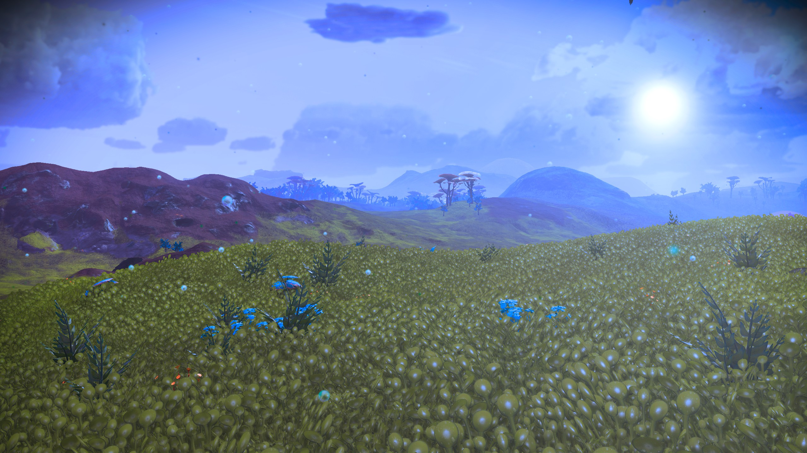
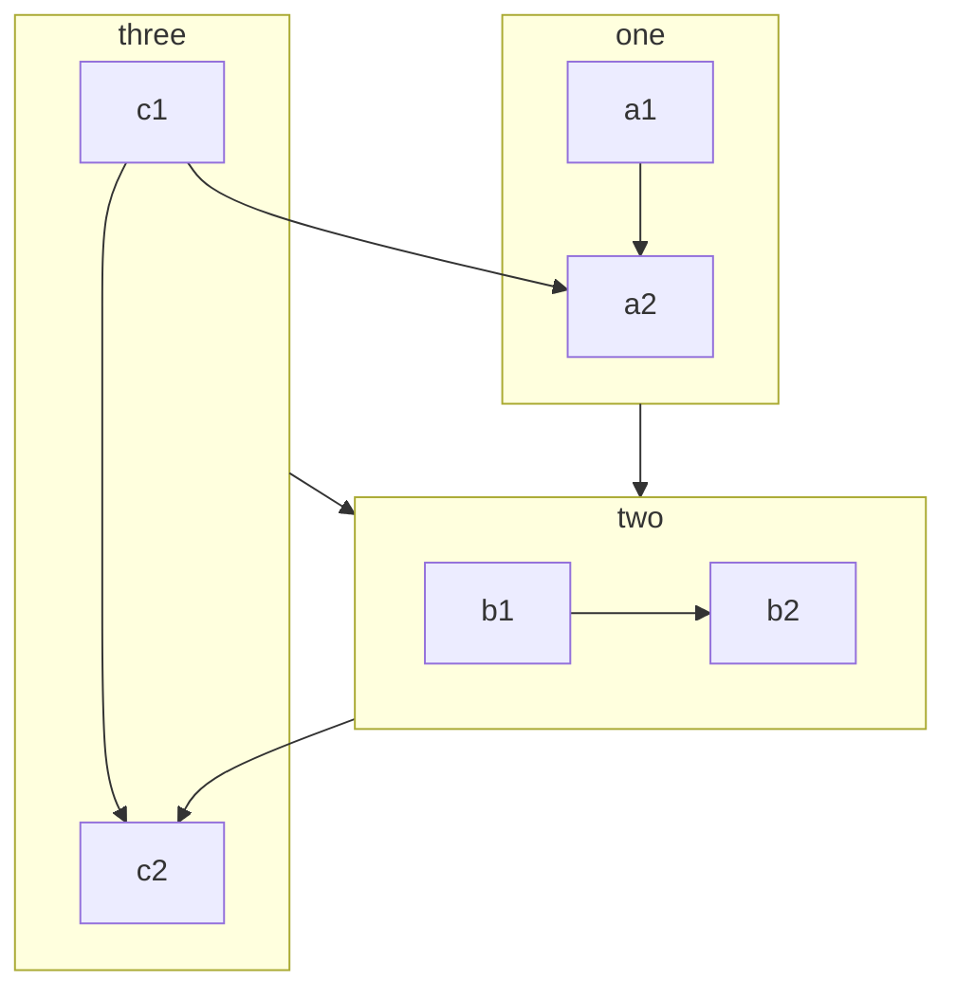

# Runtime Terrain Generation in Unity
I've always loved open world games, with their illusion of complete freedom of movement in a vast world ready for exploration.    And as a developer, I've similarly been a fan of _procedural generation_ of game environments: the notion that the game can—through application of rules—generate its own content.    In the best scenarios, this gives way to _emergent behavior_, in which those rules combine in ways that are more than the sum of their parts, and can produce results (pleasantly) surprising even to the developer.  (Contrast with _bugs_, which are results unpleasantly surprising to the developer...)

The logical endpoint of this are games like _No Man's Sky_, in which virtually the entire world is procedurally generated.

As a developer, one of the attractions of such systems is that a small team--perhaps even an individual--can create a "large" game in this way.   Since, despite what the scale tells me, *I* am an individual, and I've now got time to look into projects like this, I'm combining an effort to learn the Unity game engine with a desire to push some boundaries of procedural design.

Will this turn into something more than some musings on the web?   Who knows?   That's the wonder of it.

Another wonder of the modern internet is that you never know who's going to wander by, curtesy of Bing, Google, or the world's most specific typo.    If you're looking for me, contact information is over at https://www.chriskempke.com

--Chris

## Tools

This site is being hosted at Github Pages, but it's not using their Jekyll parser.  Instead, I'm using Docsify, with the Mermaid extensions turned on.

Mermaid allows graphs such as flowcharts and sequence diagrams:

I also enable KaTeX, which allows both inline ($c = \pm\sqrt{a^2 + b^2}$) and callout LaTeX mathematics symbols:

$$
\mathbf{V}_1 \times \mathbf{V}_2 =  \begin{vmatrix}
\mathbf{i} & \mathbf{j} & \mathbf{k} \\
\frac{\partial X}{\partial u} &  \frac{\partial Y}{\partial u} & 0 \\
\frac{\partial X}{\partial v} &  \frac{\partial Y}{\partial v} & 0 \\
\end{vmatrix}
$$

Docsify itself parses Markdown files of various sorts to produce the HTML display you're looking at now, including the sidebar to the left (or in the hamburger menu if you're browsing on mobile) and the live text search.