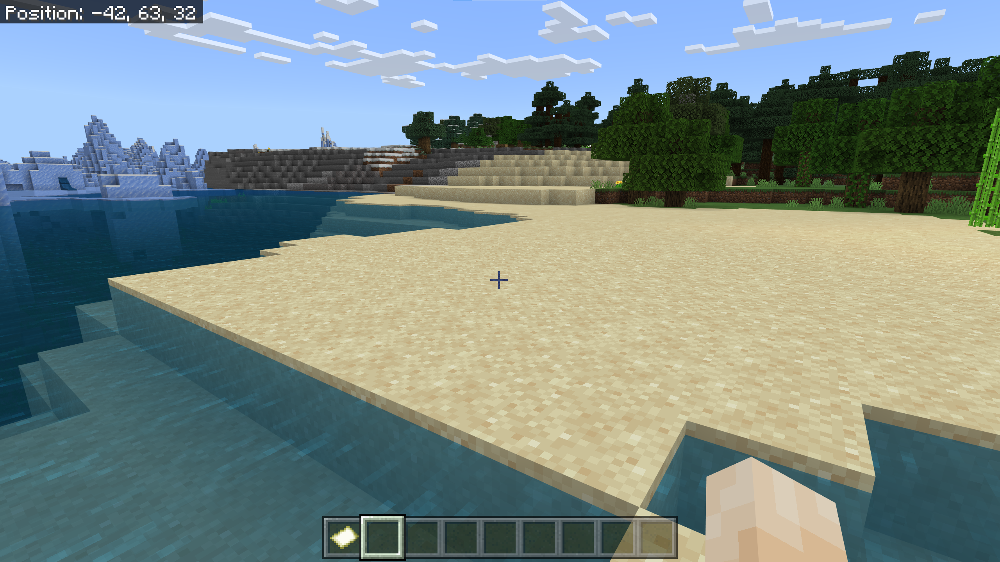
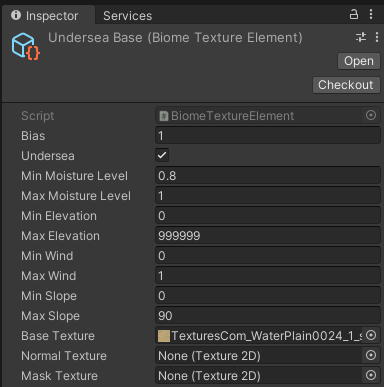

# Biomes

In our parlance, a *biome* is the physical characteristics of a terrain that aren't its basic shape.   Practically speaking, that is:

- The base textures of the ground (TerrainLayer objects)
- Imposed structure ("shape" that's specific to this biome, like pools in a swamp, spires in a badland, dunes in a desert, cave entrances, flattened regions for buildings, etc.), particularly at the local or regional level.
- Vegetation (grasses, bushes, trees) and small mineralogical (rocks, stalactites) details
- Water and water behavior.

Buildings and other sentient-being-constructed things may also apply here.   Let's ignore that for the moment, since it rapidly leaves "terrain generation" and heads toward "game design."

We're also going to ignore water-mostly.   Some of it we can treat like any other biome, placing corals, rocks, kelp "trees," and the like.   But water has all sorts of other gameplay effects (gravity, visual distance, opacity) and visual characteristics (surface appearance, caustics, light filtration) that are going to merit their own treatment later.

## Biome Maps

Early versions of Minecraft used to have fairly strict delineations between biomes:  you'd be in the desert, and a dozen steps later you'd be in the plains.  There was a little bit of "mixing" right at the edges, but for the most part where one biome ended, another would begin.  You can see the boundaries of 3-4 different biomes here (more if you count the ocean.)



_Valheim_ hides it better, but there's still no overlap of biomes.  Note the fir trees and deciduous trees don't "mix" at all:


Real worlds aren't like that (and as Minecraft has evolved, it's started blending, a little).  Changes between biomes are often so gradual that a traveler doesn't really notice them at all.  And even in the middle of, say, an arid grassland, there may be the occasional patch of scrub forest from the a neighboring slightly wetter biome.   There are also places where biome changes _are_ sudden, usually because of the presence of either drastic elevation changes or water:  a desert oasis or the green vegetation around a river or pond in an otherwise dry landscape, for example, or the even starker "tree line" on mountains above which nothing grows.

Part of this is just thinking of "biomes" as being discrete things: no two deserts are the same, and no two places in the _same_ desert are generally the same, either.   Biomes, in the computer generation sense, are a shorthand meant to increase practicality, at some cost to realism.   But even so, our model shouldn't think of a place as having "a biome", but rather being affected by "this set of biomes" to different degrees.

So ideally we'd like to have a floating-point map for every biome we support, so we can look at a specific tile and say things like "this tile is half underwater, a quarter beach, and the rest rocky cliffs", or "50% desert, 50% arid grassland" when we're generating the actual tile.

Is that practical?  Maybe.  A roughly million-meter-per-edge map (1024x1024 meters) using 256x256 terrain patches is probably a good case for the largest practical map we can generate.   That's 4096x4096 total tiles, which at a 32-bit floating point value per tile is 64 MB per map, and we'd need one of these per biome type.   Add a little bit of overhead, and we can probably expect to store about 15 biome maps per gigabyte of ram.

How many biomes are we looking at?  The Internet tells me that _Minecraft_ has about 60.   _Valheim_ has about a dozen.  *No Man's Sky* has nine, but uses a trick we'll see below to effectively have much more.   All of these are much lower than the real world.  The total number varies based on who you ask:  NASA says 7, various sources say 6, others say 12.  But the one thing they all have in common is that these "real world" numbers are using a _vastly_ more inclusive definition of "biome" than a game would.   For example, they lump all "temperate forests" together, regardless of tree species and other differentiators -- nearly all of the eastern United States is a single biome in that sort of categorization.   The root cause of this is that the ecological definition of "biome" differs a lot from the game-development definition.   For our purpose, I'm going to make a back-of-the-envelope guess that "Earth" has between two thousand and five thousand different game-style biomes; and frankly, I might be low by orders of magnitude.

Nobody but the most dedicated game developer is likely to generate anywhere near that, but 100 biomes doesn't seem out of the question.  That's almost 7 GB...just for biome maps, and not counting things like the terrains themselves, which can be similarly sized.   Other than a fairly high-end gaming PC, that's going to be pretty prohibitive:  the Playstation 4 had only 8Gb of RAM, and even it's successor has only 16.   Many iPads have less than 4GB (note that this is RAM, not storage.  Apple doesn't usually publish the RAM number).  Android tablet RAM can be larger--or much smaller.

So, practically, we can't do this.   What are some options?

### Smaller Maps 

The above calculation is "worst case" in the sense that it's the largest we're likely to generate while having the Global Terrain Template still fit in a Unity Terrain (even at 4096x4096, Terrain objects aren't very performant except on very powerful systems).   We can do the math for some other combinations, of either smaller total worlds or larger patch sizes:

| World Size (meters)   | Patch Size (meters) | GTT Tiles | Map Size (1 float/tile) | Biomes/GB |
| --------------------- | ------------------- | --------- | ----------------------- | --------- |
| 1,048,576 (~1M sq km) | 256                 | 4096x4096 | 64 MB                   | ~ 15      |
| 1,048,576             | 512                 | 2048x2048 | 16 MB                   | ~ 60      |
| 1,048,576             | 1024                | 1024x1024 | 4MB                     | ~ 250     |
| 262,144 (~64K sq km)  | 256                 | 1024x1024 | 4MB                     | ~ 250     |
| 262,144               | 512                 | 512x512   | 1MB                     | ~ 1000    |
| 262,144               | 1024                | 256X256   | 256 KB                  | ~ 4000    |

That gives is a nice set of options we can provide to the developers:  based on how many biomes you want to have and the size of your memory constraints, here's how much map you can have.  Even the smaller map is about half the size of England, so large enough for many games.

### Compress the Maps

As our number of biomes increases, more and more of our biome maps are going to be sparse.   That is, most entries in the (say) 4096x4096 array of floats will be zero.   For worlds with only one sea biome, that particular map will have a lot of "1f" in it, and a lot of "0f" in it, and only the shorelines will have any other value.

Whenever you see "lots of the same value," and especially "lots of the same value in large regions" in an array, that screams "compressibility."   Any decent lossless compression algorithm will do wonders on making these smaller; that 64MB biome map we were describing above would probably compress to 5-10K in most cases.   Whether or not this is practical will depend on how often and how much effort it takes to uncompress them when we need them.

Another compression possibility is to not use a map of the whole world, but rather just the bounding boxes of each particular biome (and if a biome appears in, say, 8 places, store 8 much smaller bounding boxes).  This eliminates much of the empty space while adding just a bit of complexity to the data structure and time to the lookup.

And we can let someone else do much of that work for us:  there are numerous implementations of "sparse arrays" out on the Internet; these are data structures that effectively omit the zeros blocks and just store the elements with values in them.  There are different implementations with different tradeoffs.

### Don't store them in RAM

For many platforms, 7GB is no big deal as long as it's not in memory.  Hard drive and SSD flash memory is relatively cheap, and most non-mobile platforms have lots of it available.   Even on mobile, a 10-15 GB game (or larger) isn't unheard of, although it's going to limit your potential audience.

So if we just write these maps to disk immediately on creating them, and load them back when we need them just a few at a time, we can trade off disk access for memory.

The downside here is that loading from spinning disks can be extremely slow, and even from SSD is usually a few hundred times slower than memory.   And we're going to need these maps a lot -- the simplest algorithms are going to require looking at every biome map (or at least one cell of every map) at the creation/loading of every single terrain patch.

That "one cell of every map" implies that if you want to go down the rabbit-hole of memory-mapped files (where a file's contents are assigned to a set of otherwise unused memory addresses, and the file acts like a sort of specialized swap file), you'll need to make very few actual memory page loads: generally just the pages that hold the single value for the tile you're interested in, and because of locality (the player will generally be moving to nearby tiles), you'll hit cache a lot in most real-world usage.

### Allow Biomes to self-differentiate

This is a technique _No Man's Sky_ uses:  let a "biome" describe a set of options rather than a particular specific set of characteristics, and then choose a specific value of those options for each instance of that biome occurring.    For example, we could use something like the "temperate forest" biome, but give it several options for "dominant tree species"  (oak, aspen, pine, fir, maple, etc.), base texture, undergrowth, density, etc.

Then, using some value available at runtime ((x,z) position, wind or moisture levels. perlin-class noise, elevation, temperature, whatever), we select a specific set of those options for each area of the biome.

This mechanism allows us to compress a lot of "specific selection" biomes into one "smart biome," effectively by bringing the implementation of "biome" closer to the natural science definition of the word.

There are two tradeoffs here.   The first is complexity for the developers that need to create these biomes.   They need to understand and implement the options available, as well as build separate biomes any time the various "options" can be incompatible with each other. (For example, if certain undergrowth can't occur with maple trees, then they either need to be separate biomes or we need to build in exclusion mechanisms.)   The opposite is true as well:  it seems perfectly reasonable for a pine forest and an aspen forest to overlap (both are cold-tolerant, high-altitude trees), but since we're using the same biome for both, the biome needs to _always_ allow both types of trees or the overlap is impossible without moving one to a second biome type.

The second tradeoff is on us:  we need to make sure that whatever value we use for the "select a set of options" index is consistent (or smoothly varying) over the entire region of a biome (e.g. even across multiple tiles), in order to prevent our "pine forest" from abruptly turning into a "maple forest" at a tile boundary.

### What's this "Biome" thing, anyway?

The last option we'll consider here is eliminating the notion of "biome" altogether.  *Biome* is a shorthand for a set of specific options:  ground textures, vegetation species, etc.   If we talk a step back a bit, what we're really saying is "these things tend to occur together."   Our human tendency is to group and name categories:  that's a "swamp" not "an area with shallow pools, a lot of mud, snakes, alligators, noxious gas clouds, and quicksand."    So, it's natural for us to try and place "swamps" in our world.

But the alligator doesn't care that he lives in a "swamp."   He cares about having deep enough waters to float in, moving slowly enough to conserve his swimming energy, enough prey to eat, temperatures warm enough not to cause torpor, and enough overhanging vegetation to create shaded places to hide or sunbeams to bask in.   If you provided all those things, but called the result a "desert," the gator would still be happy there.  _A rose by any other name,_ and all.   The snake may have similar desires, but with fewer moisture and water constraints, so it can live in more places.

Unlike the real world, a game world won't have millions of animal species, tens of thousands of plant species, and an infinite variety of rocks and minerals.  All of them together are unlikely to top a few hundred, at least not if you ever give your artists any time off.   The number of ground textures might be a little higher, but probably under a thousand of those, too.

So if each of those plants, animals, minerals, and ground textures, has a detailed set of dependencies (temperature, moisture, animal and vegetation density, groundwater, sunlight, elevation, daylight/nighttime hours, latitude, underground or underwater, proximity to open water, etc. etc.), and our world is sufficiently defined that we can determine whether any given tile (or even smaller region, like an oasis or lake) matches those dependencies (and maybe how well it matches them), well, what do we we need biomes for?  And if we need to differentiate them even further, we can create artificial dependencies, like requiring a certain minimum value on a Perlin-class noise field as well as everything else.    

There are difficulties:  We may be implicitly or explicitly forcing an order to the generation of tiles: for example, if pandas require bamboo, or koalas eucalyptus, then we need to make sure that plants are always placed before the animals.  Plants, in turn, might depend on certain base terrains (it's atypical for a tree to grow on rocks).   But as long as we avoid (or resolve) circular dependencies, this should be workable.

In some sense, this would be trading one set of maps for another:  we now need to keep track of a lot of different attributes of our world in order to answer the various dependency questions.  But consider:

- The total number of these attributes is likely to be much smaller than the number of biomes.   For example, just four floating-point attribute values would give us potentially millions of specific combinations, even if we didn't require very high floating precision.
- Several of these (elevation, moisture, wind) we're storing anyway, since we need them in other parts of the generation engine.
- Others--like temperature, latitude, and sunlight--can be calculated in whole or in part from combinations of other variables.
- And several of these maps are pretty slow-changing with respect to distance; we could probably keep them at lower resolution than the heights.

An advantage of the "no-biome" solution is that it makes nearly all of these decisions local:  we make the maps once at world creation, but the actual placement of stuff happens on patch load at runtime.

## The No-Biome Experiment

So let's start by trying out the no-biome mechanism.  Instead, we'll just give the various things (textures, details, trees) that would normally be part of a "biome" a set of dependencies, and let the "biome" behavior arise as a sort of emergent behavior.

```c#
[Serializable]
public abstract class GenerationDependentObject : ScriptableObject
{
    [Tooltip("Relative commonness (lower numbers = rarer) of this entity.")]
    [SerializeField] public int bias = 100;

    // Dependencies
    // Sea (note that shallow water isn't considered sea, but 
    // does have a 100% moisture level)
    [Tooltip("If true, this entity appears in deep waters.")]
    [SerializeField] public bool undersea = false;

    // 0 - .9 are the standard land range.  Items above 1 appear only in water.
    [Tooltip("Minimum moisture level required for this entity. 0-.9 for land, 1 for pond/river/shallow water.")]
    [SerializeField] public float minMoistureLevel = 0f;
    [Tooltip("Maximim moisture level required for this entity.")]
    [SerializeField] public float maxMoistureLevel = .9f;

    // Elevation.  Real range is 0 - WorldGenerator.maxHeight
    [Tooltip("Minimum elevation (meters) for this entity")]
    [SerializeField] public int minElevation = 0;
    [Tooltip("Maximum elevation (meters) for this entity")]
    [SerializeField] public int maxElevation = 999999;

    // Wind. Range 0-1
    [Tooltip("Minimum average wind likelihood")]
    [SerializeField] public float minWind = 0f;
    [Tooltip("Maximum average wind likelihood")]
    [SerializeField] public float maxWind = 1f;

    // Slope
    [Tooltip("Minimum slope (absolute value of degrees) for this entity")]
    [SerializeField] public float minSlope = 0f;
    [Tooltip("Maximum slope (absolute value of degrees) for this entity")]
    [SerializeField] public float maxSlope = 90f;
}
```

__GenerationDependentObject__ here will be the base class for anything that has dependencies.    We're almost certainly going to need more attributes to be dependent on, but this gives us a good first set.

If you're unfamiliar with Unity, the "Serialize" and "SerializeField" attributes just mark the class and the fields in it (respectively) as being able to be handled by the built-in serialization system.  That is, they can be turned into some intermediate object and restored from it, often used for save/load mechanisms.    It also makes the fields visible in the Unity editor when inspecting an asset of this type (not strictly necessary on the fields, since all public fields also appear in the editor by default, but we're likely going to need to serialize these, and it's standard for ScriptableObjects.)    The "Tooltip" attributes, as you might guess, provide the tooltip "hint" when the user hovers over one of these in the editor.

The key here is deriving from **ScriptableObject**, **GameObject's** oft-misunderstood cousin.   

**GameObjects** are instances of thing that have physical presence in a Scene (most specifically, a transform).  C# Scripts and other  components added to that GameObject allow additional properties and functions to make it serve a particular purpose:  a terrain, a camera, a player model, a treasure chest, a monster, whatever.  When the Scene ends or is changed, these are typically destroyed; they don't have meaning outside of the transform space.

**ScriptableObjects**, on the other hand, are assets defined entirely by their scripts; they are persistent and provide descriptions of things that don't necessarily "exist" as a specific placed entity in the game world.   They're often used to provide the set of options from which a **GameObject** will choose, or that serve as "global" things that survive between scenes and even games; they're very close in structure to a database row.

For example, you might define a "WorldItem" **ScriptableObject** type to describe the things that a player can pick up, drop, equip, and store in inventory, and then make specific **ScriptableObject** instances of "Sword," "Axe," "Plate Mail," etc., each of which defines the attributes of one item (weight, equipment slot, stackability, icon, model, etc.).    When a developer wants to add a new item to the game, he/she creates a new instance of the **ScriptableObject** to hold the properties of the new item.   Note that these are _possibilities_ for inventory items; not every one of which will appear in a scene at any given time.     When an item needs to appear in the world, some script attached to a **GameObject** will reference the inventory item **ScriptableObject**.

**GenerationDependentObject** is an abstract class (you can't instantiate it directly, only a subclass).   So let's make a concrete subclass of it to hold terrains:

```c#
[Serializable]
[CreateAssetMenu(fileName = "BiomeTextureData", menuName = "WorldGeneration/BiomeTextureElement", order = 1)]
public class BiomeTextureElement : GenerationDependentObject
{
    // Base element texture
    [SerializeField] public Texture2D baseTexture;

    // Optional normal maps and mask maps.
    [SerializeField] public Texture2D normalTexture;
    [SerializeField] public Texture2D maskTexture;
}
```

That "CreateAssetMenu" attribute is a key to editability here:  it creates a base menu called "WorldGeneration" in the "Create" menu that appears when you right-click in the Assets, and a specific "BiomeTextureElement" entry on that menu.

Whenever I want to create a new texture, I right-click in the Assets, select WorldGeneration->BiomeTextureElement, and a new **BiomeTextureElement** asset is created.  I can use the inspector on it like any other asset, in this case to set up to three textures (the baseTexture is mandatory, the other two are optional), as well as all the attributes inherited from **GenerationDependentObject**.



In this particular case, the sample texture I've got doesn't have a normal or mask map, so I just set the base texture.  Most of the rest of the fields are self-explanatory, but let's talk about bias for a bit.

### Bias and Rarity

This is a trick I use a lot for "choose from a list of items of unknown length at random" type problems, which appear extremely often in game design.  The idea's certainly not original with me.

The idea here is that you give every potential element a "Bias" field, which is sort of an inverse of the idea of rarity.   A higher bias means this object is more common than if it had a lower bias.

The algorithm is pretty simple:   First, we filter out the objects (terrains, monsters, trees, whatever) that don't match our criteria.    From whatever's left, we sum the biases, choose a random number less than that sum, and then remove each item's "bias" from that random number one at a time until there isn't enough random number left to subtract, at which point the object we're currently looking at is selected.

As an example, let's say we've got five items, with these rarities (Hat, 1) (Glove, 3) (Sword 3) (Magic Toothpick 1) (Health Potion 5).

Those biases sum to 13, so  we pick a random number from 1-13.    Let's say that random number is "5", which becomes our target:    

- "Hat" has a rarity of 1, which is less than our target number, so we subtract 1 from the target to get 4, and discard "Hat" as an option.   
- Next, "Glove" has a rarity of 3, which is still less than our target 4.   So we discard "Glove," subtract 3 from our target number (giving us 1), and look at "Sword."    
- "Sword" has 3 rarity, which is _higher_ than our remaining target (1), so we've selected "Sword" as our item.

Most notably, biases are unitless (or maybe more accurately, they define their own units).  They tell you the relative rarity of each possibility compared to all the others, on whatever scale you want.    For example, if our intrepid adventurer opens a lot of chests, in the long run, we expect him to have received five times as many Health Potions as Magic Toothpicks.

### Base Terrains

You'll notice that the name I gave the example BiomeTextureElement, above was "Undersea Base."   I don't mean that in the sense of a place for supervillains, but rather that this is the _base_ texture for undersea terrains (_Undersea_ is checked.)   I've got a corresponding "rock" terrain that is the "Land Base" texture for non-undersea terrains.

By "Base Texture," I just mean "the texture that will get selected if nothing more specific fits."   In this case, the rest of the dependencies define the entire range:  these "base" textures can apply to any slope, elevation, moisture level, etc..  They have a bias of (1), which means that no matter what scale we end up choosing, these will be the rarest textures.

We're likely to have a lot of BiomeTextureElements.  The more we have, the more varied our world will look.  Some will have broad applicability, some will have very narrow acceptable dependencies.   As we add more content to our world, the set will increase, and in theory, we'll have nice terrain elements that match any combination, and hopefully we'll have _several_ textures that match any actual combination, so that every square of a given terrain patch doesn't end up looking similar to every other.

But...if we mess up, if there's a terrain location that doesn't match _any_ set of dependencies, at least it will match this one (or rather, either the land or sea one), and get a reasonable default (sand underwater, rock above).