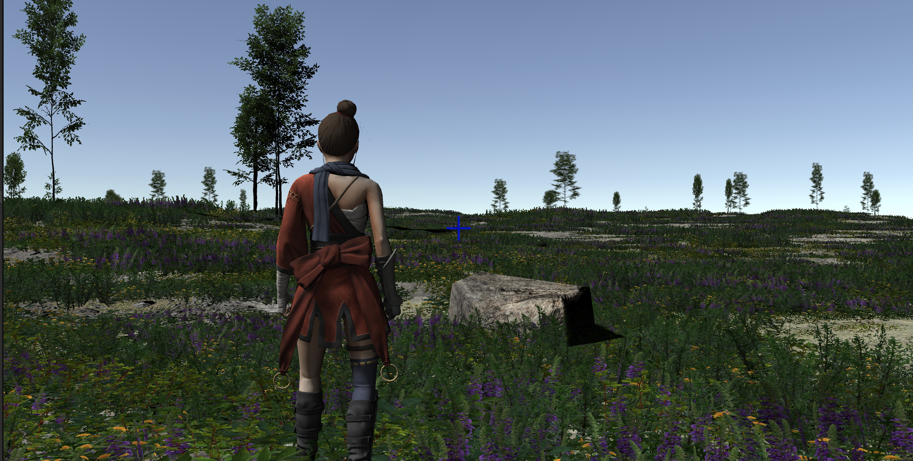
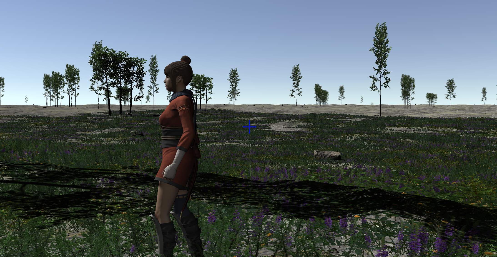

# Biome Elements

Continuing with our "self-creating" biomes experiment, we derive four classes of object from **GenerationDependentObject**.   These might seem to be arbitrary distinctions (and to some extent, they are), but they were chosen to match specific features in Unity:  See [Unity Notes](biomes-unity.md) for some information on these implementations.

- **BiomeTextureElements** are the base terrain textures (the "flat" area that is intended to represent grass, rock, snow, mud, whatever) that underly everything else.
- **BiomeTreeElements** are Trees and other simple-collider-based solid objects placed into the Unity "trees" layer of the terrain.   If the tree models are built for it, they support structural variation, size variation, and automatic level of detail handling (in Unity, that means billboard -> model transformation at a specified distance from the camera).  They can also (again, model permitting) bend and blow in the wind. 
- **BiomeDetailElements** are placed into the Unity "details" terrain layer.   They are objects which do not have colliders (that is, the player can walk right through them as though they weren't there, and they don't participate in physics.).   We're using them primarily for grasses and small plants, and some underwater stuff like corals.
- **BiomeFeatureElements** are whatever's left.  These are "real" mesh objects.   We use these for large rocks/rock formations and other features that the player needs to physically interact with, and therefore need more sophisticated colliders (often mesh colliders) to allow the player to step on, climb, or whatever without visual artifacts.   This is a concession to playability:  if your application doesn't require a player or other element to interact with it directly (for example, a "fly-through" scene in a movie), "Features" can just become "Details" or vice versa.

> **Uh, About Those Models:**  From here on out, we're going to start needing a lot of models of _things_ (plants, ground textures, trees, rocks, maybe even things like animals) to fill in our world.
>
> I have a level of artistic talent comparable to a not-particularly-precocious five year old.   Much to the disappointment of everyone who's ever tried to teach me artistic abilities, I could probably reduce Bob Ross to tears.
>
> Up until now, I've been using texture packs from Unity itself; either stuff that's built in, or available from the Asset Store in the sort of packages that used to be called the "Standard Assets."    I'll continue to use those, but they don't give a sufficient breadth of models for much of a varied world.    Nevertheless, if you're looking at the WorldForge source code, that's all that's going to be used in the sample biomes there, because it's all that I can be sure you (dear reader) have access to.
>
> For this documentation, though, and my own use, I'm extending this with assets from numerous professional artists.  These are obtained through the asset store, various sources on the Internet, and probably other third-party sources.    So for the elements of the world that _are not_ procedurally generated, you'll start seeing more variety in the screen shots.

## Initial Implementations

Once we define a handful of these Biome Elements of each type and provide them to our world generator for selection, we start getting some more interesting landscapes:

The underlying textures here (visible in the "bare patches") are texture elements, the sunlit rock is a feature, the grass and heather are details, and the various trees are...well, trees.   Some of the closer trees are models, the more distant ones are billboards for performance.

### Terrain/Feature mismatches

There are some issues here.    One of them isn't visible from this viewpoint, but looking at another shot where the woman is relatively higher:

That "bare ground" in the distance is the "detail render distance" being exceeded.   This is a performance setting present in most games/engines that prevents the rendering of vast numbers of meshes.

Note that there _is_ ground cover over in that bare area:  Unity just isn't rendering it for performance reasons.   And that makes sense, given that in the screen shots shown here, there are over 250,000 individual "patch of grass or flowers" models per terrain patch.   Since we have adjacent patches, as well, there are probably several _million_ ground cover models potentially available to be rendered.

(It's worth noting that Unity does extremely well with this vast amount of data:  on a 2022 Mac Studio, I'm still getting over 200 frames per second with the detail distance set to 100 meters.)

The general idea is that players don't need to see explicit models for small elements that are very distant from the camera.   If the game has "fog" limiting the player's vision, it's usually set so that the vision distance and the detail render distance are similar.    For more modern games with longer visual ranges, the expectation is that the ground cover will be captured in textures at range.

You can see a related issue with this shot from above, looking down:

The problem here is that the texture engine picked a rough, rocky soil as the texture for this area, which doesn't blend very well with the plants growing from it.   This has several issues:

- The texture being so different from the ground cover makes the detail draw distance very obvious.
- The texture being so different from the ground cover makes the ground cover look "thin" unless we make it very, very dense (which has its own performance issues).
- You don't get significant ground cover growing out of hard-packed, dry rocky soil in the real world.

The logic here was sound:   both the ground cover and the ground texture are both appropriate for the level of moisture, wind, elevation, etc. at this location in the world—they're just not appropriate _for each other_.

From the images above, you can also see that ground cover continues under the trees, as well, even when those trees are in small groups.   Real-world trees tend to reduce the grasses and such directly beneath them (by blocking sunlight and absorbing water and nutrients.).   So the ground cover and the trees probably need to "know things" about each other, too.

So a first takeaway here is that we need to find a way to make different types of elements combine into more logical pairings, ideally without having to resort all the way back to predefined "biomes."

### Clustering

Let's look at this screen shot again.    The trees here are fairly uniformly spread out (the 3-trunk tree groupings here are a single model and placed as a unit).    But real trees don't do that.   This is too sparse to be a forest, but even sporadic trees tend to cluster (often around water) rather than this sort of uniform distribution.

On the other hand, the ground cover is _too_ uneven.  Certainly you see patchy cover like that sometimes in the real world, but there's a reason why people talk about grasses using "blanket," "sea," and "wave" metaphors.    Usually ground cover is fairly even, at least across large areas that are uniform in lighting, moist, and elevation.

In both cases,  the visuals above are a result of a more or less "pure" random distribution.

There's not enough variety in the trees here yet for it to matter, but there's also a sort of "species clustering" that occurs in nature, as well.  Forests are often primarily of a single species of tree, and even in mixed-species ones, they tend to cluster together in groups of single species rather than a very uniform mix.

### Density

We also need to consider the total number of elements in a given space (in our case, the "terrain patch" makes a good unit of area).   The above implementation just uses some uniform "Tree Density" and "Detail Density" numbers from the world generator, but we're going to want to control these on a much more granular level.   And it applies across all the element types:  a forest has far more trees than a scrubland, which in turn has less than a tundra, seashore,  or desert.    But that seashore likely has more large rocks (as would a mountainside, for different reasons).   The numbers of almost any plant are going to vary based on moisture levels, especially in combination with winds.    Even for something as simple as a single tree species, we're likely going to want to either define several different element blueprints for it (say, "maple trees in a forest", "maple trees in a meadow," or "maple trees along a coastline"), or give those blueprints a direct way to vary density based on light, elevation, moisture, or whatever.

> **Performance Note:**   We'd expect objects with complex colliders and a broader set of materials to be slower for Unity to render, and these experiments clearly show this to be true.    Adding 500,000 grass patch details has less effect on frame rate than a mere 1000 feature rocks (at least for the models I was using).  This is exacerbated by the Level of Detail (LOD) support in Unity:  Terrain-based tree and detail maps have sophisticated and automatic LOD support (billboards, distance culling, GPU instancing, etc.) that's not automatically present for basic prefabs.    So as a specific implementation detail, we either need to keep our total "feature" density lower than the others, or build our own LOD system around them.

### Hard Limit Boundaries

One final issue:

This isn't distance culling.   Rather, the player is standing near a tile edge, and the tile to the right has a moisture level that's just *slightly* outside the limit of the ground cover blueprint.  So you get heavy ground cover in the left-hand tile, and none at all in the right hand tile, with a visible line separating them.  (The "fuzziness" of the line is because the ground cover models cover a significant area, so they "overlap" to different degrees.)

So we also need to consider falloff or blending of tile attributes.   Either the tile on the left should have almost no ground cover (because it's so close to the moisture limit that will disallow it), the tile on the right should allow some (because it's close to the moisture limit that will allow it, or just because it knows there's some on the tile next to it), or both.   An "all or nothing" hard limit gives us these obvious lines as you cross borders.  You wouldn't expect that on a large world with relatively slow-changing parameters this would crop up very often, but I've seen it happen a bunch of times even in my development to date.

## Second look at GenerationDependentObject

So, armed with some results, we can go back and add some capabilities to the **GenerationDependentObject** class, to give us more control over the "biomes" generated, and to the generation system that uses it.