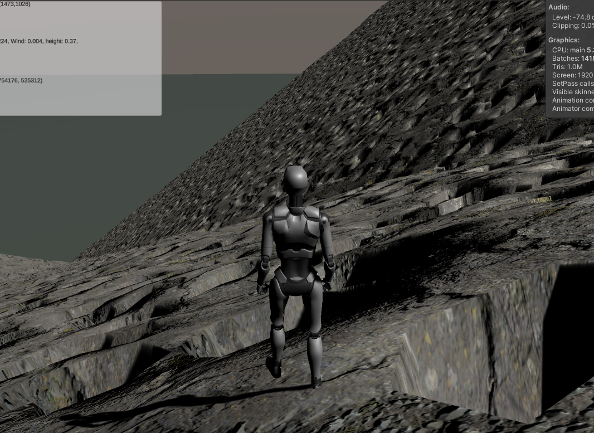
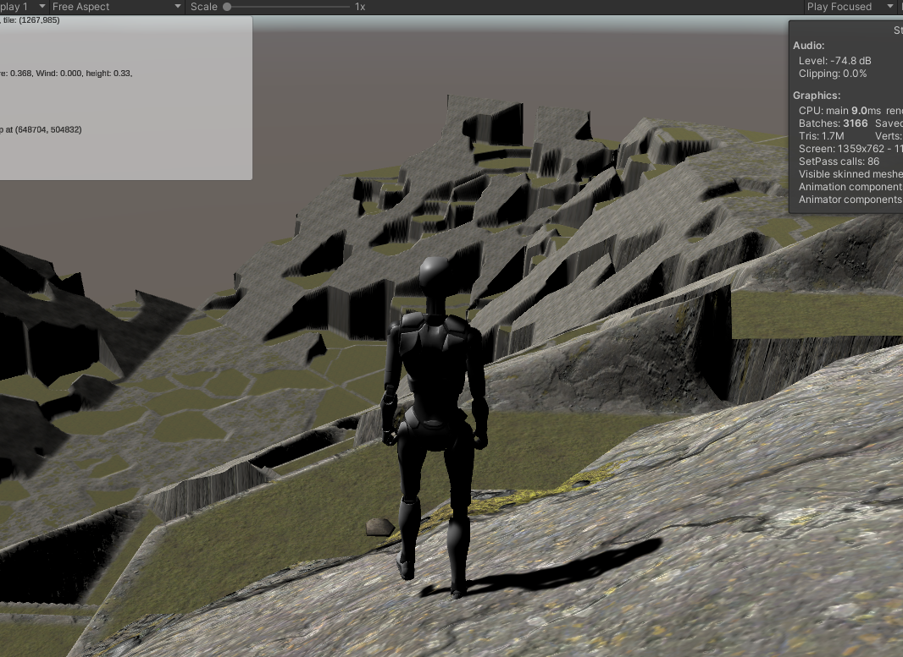
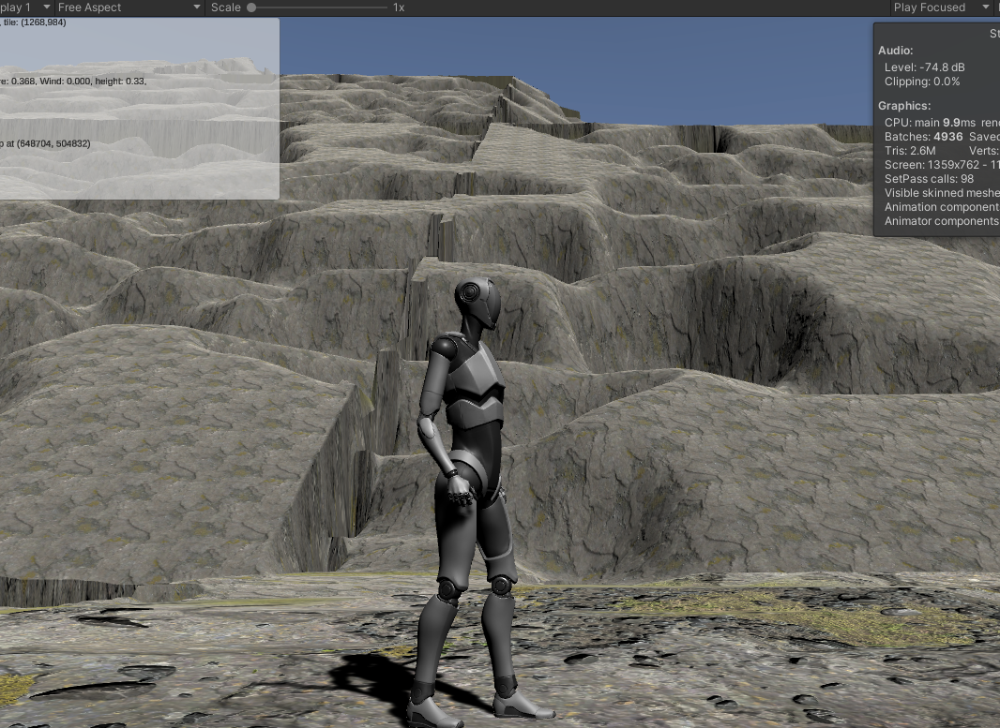
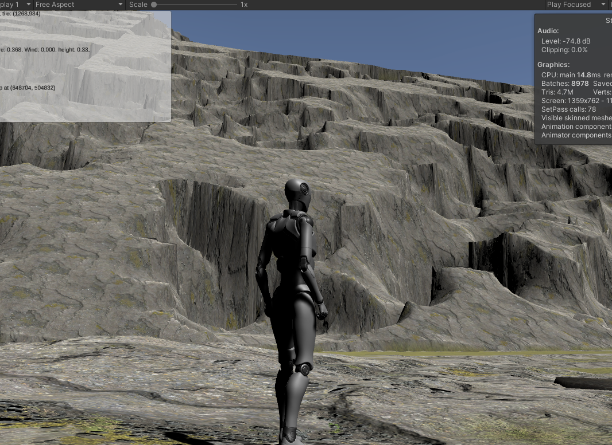
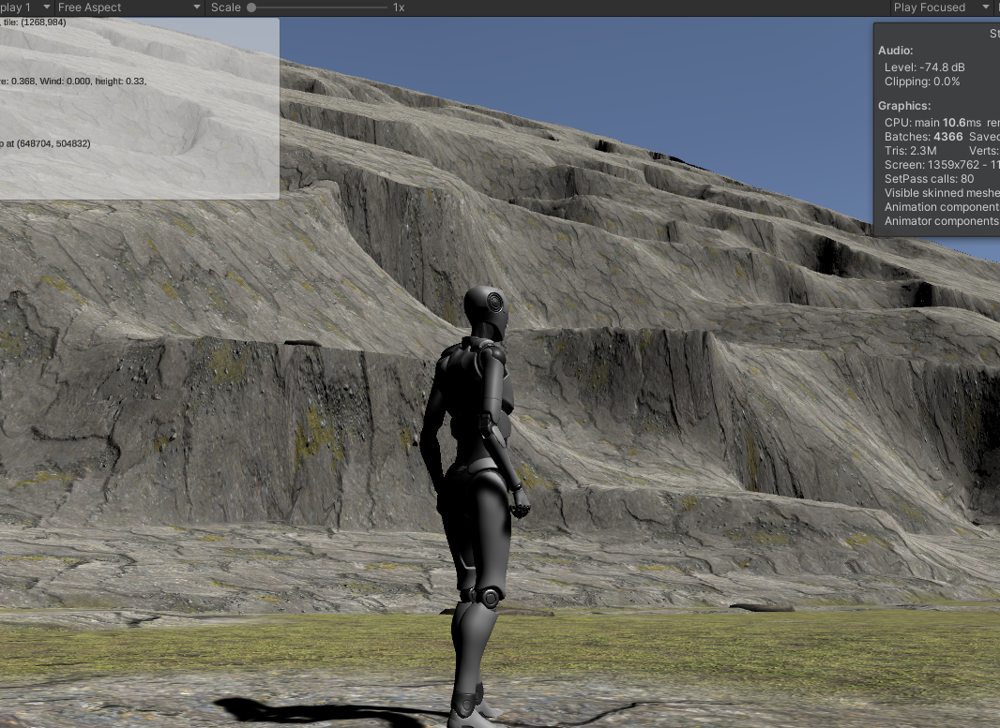

# Implementing Erosion

So at all scales of our terrain, we want to see the effects of erosion.   Algorithmic generation tends to be either overly blocky or overly smooth to pass for real world terrains--in a single word, it's just too "uniform."

Jacob Olsen describes a number of techniques for implementing erosion in his paper here:  https://web.mit.edu/cesium/Public/terrain.pdf, and Dr. de Byl covers the same and others in her Procedural Generation course at Udemy or the Holistic3D web site: https://www.h3dlearn.com/course/procedural-terrain-generation-with-unity.  

We'll use some of those.    But we've got a few quirks to throw in the mix.    One is that despite the generally fractal nature of the real world, many of these scale poorly outside of their domains:  the techniques that erode mountains nicely in at something like our global template level don't work nearly as well when we're coming down to individual terrain-patch slopes.   Inversely, things like raindrop erosion make no sense at all on global scales.   The second is that many of these are very expensive, requiring hundreds or thousands of passes over the terrain to build their shapes.

We can accept that level of computational expense for the global template generation -- it's likely to take many seconds or even a few minutes to generate that world model, and since for most games it'll be a one-time (or one time per "new game") expense, we'll just suck it up.   But our more local levels (regional, patch) need to be generable in real-time.   Terrains can't take more than a few seconds to generate:  after a teleport or on initial load because the player is _waiting_ for them, and in buffer patches because we don't want the player to be able to get close enough to the generating patches to see it when it "snaps in," or worse, to fall off the edge because the new patch isn't ready yet.

## Landslides and Shearing

*Nomenclature: Dr. de Byl's course calls these "Thermal" and "Rivers," respectively.  In our larger context, both of those terms are likely to cause confusion with other concepts, so I'll stick to the more visually descriptive terms.   Other papers tend to describe shearing as "hydraulic," which I'm avoiding since it describes the mechanism rather than the result, and I'm applying some of these more broadly.*

These two effects are similar.  In both, material is removed from a higher point and potentially placed at a lower one.   

**Landslides** are the more gradual process, basically a movement of material from steeper points to shallower ones, tending to result in a flattening of the entire structure (think the little movements down the side of a pile of sand to which more sand is being added).   Unless iterated on a lot, this is a pretty subtle effect, generally dwarfed by both any addition of Perlin-class noisse or smoothing.  It's effect is also a _lot_ like that produced by the Gaussian Blur (which also tends to make slopes shallower), while being more expensive to implement.  Because it's so subtle, I don't actually implement it anywhere at the moment.

The classic implemenation here is basically:

```pseudocode
repeat a lot
   foreach x in xdimension
       foreach z in zdimension
           foreach neighbor of (x,z) (often in random order)
               if (x,z) is "sufficiently" higher than the neighbor
                   remove a little bit from (x,z)
                   add it to the neighbor
```

**Shearing** is sort of the same effect in reverse, where large pieces of terrain are "sheared" away from their parent (in the real world, generally by expanding ice or erosion of softer material) and disappear.  This turns gradual slopes into steep cliffs and drops, separated by flatter (but often still sloped) areas.  This is a geologically sudden event, and is largely what gives young mountains their jagged appearance.   As they age, the landslide effect described above makes the mountains smaller and smoother, eventually wearing them down into mere shallow hills.  In the real world, most of the material is---at least initially---deposited lower down as large debris.  But this debris erodes away much faster than the structure that it came from, so it's often absent entirely below sheared cliffs.

The classic algorithm here is a little more sophisticated

```pseudocode
repeat a lot
   pick a location (x,z)
      lower our height by a fixed amount (the "strength")
      repeat a few times (the number of "rivulets" or "cracks")
         find a random neighbor that's lower in height
            set the neighbor to our height
               then recurse on that neighbor (up to a given depth)
```

This basically makes "cracks" spread out downhill from a given point, which leaves a sort of field of depressed terrain (with some spikes) behind.   A subsequent guassian blur removes or dampens the spikes.  The net effect is like a flat-bottomed scoop was taken out of the terrain at "strength" depth down from the highest point.

It looks good, but it's incredibly expensive.   On a steeply sloped 512x512 terrain, even 10,000 iterations is insufficient:



That screen shot is without the guassian blur, and the terrain took over 20 seconds to generate on my fastest machine (an Apple Silicon M1 Max; it takes more than twice as long on the game PC).   This is basically just a bunch of pits (the blur smooths them out a bit, but it still looks like a bunch of less-sharp pits).   At a guess, getting something natural looking there would take hundreds of thousands of iterations (and some tweaking of the rivulets / strength parameters), or adjusting to make each "pit" many, many times larger.

Note that this algoritm works fine in environment where the features are relatively small compared to the resolution of the height map:  such as our global terrain template.   But for our detail patches, it's going to be too expensive.

## Shearing Algorithm 2

We've been in this situation before:  the "classic" algorithm isn't working (or rather, it's working exactly as intended, but it's too expensive and finicky for "unattended" realtime use).   

The real problem here is human judgement:   I'll spare you images of the effects of the above algorithm applied to shallower slopes or plains.  But the general idea is:  we can make it work in each situation, but only by testing out various parameters until it "looks good."   If we want fully procedural generation, though, we can't be tweaking for every possible scenario.

So we'll borrow the idea from our canyon-based mountain implementation:   we'll erode in reverse.  We know what we want it to look like when we're done, so we'll start with that and work it backward.

So here's the new plan:

```pseudocode
repeat a few times
   on our slope, take a large, contiguous area, and push it all down to the lowest height it touches.
add a little noise
smooth the results a bit.
```

And contiguous areas are no problem for us, since we still have a cheap Voronoi-ish algorithm lying around from the inital world generation.   So:

```pseudocode
generate a voronoi(-ish) map for our terrain
pick a subset of the generated regions
for each element of that subset
   push the whole region down to the lowest height in the region.
add a little noise
smooth the results a bit.
```

For a similarly steep hillside, that give us this:



That's a lot closer to what we're looking for.   That's using a 50% pushdown (that is, half the regions are "flattened" to their lowest point.).  The average region size is pretty big, which translates to a lot of very high cliffs.   Both of these values are easily tweaked.   Better, the algorithm doesn't distort less steep terrains nearly as much.  It's still probably too much to use _everywhere_, but it's not wildly disruptive.

This also has a game-friendly function, in that there are generally "paths" up the mountains that avoid the drops, although sometimes you need to go significantly far "out of the way" to reach them.   This will make our life a little easier when we get to the "gamify" functions, later.

This is still pretty unnatural looking:  the slopes are too even, the lines at the edges of patches are too sharp, and since this is implemented independently on each patch, it makes some very weird things happen along the stitch lines.     But, baby steps.

With a little more tweaking, looking "up" a mountain gives us a sense of how bad the seam-stitching is going to be:



We can see at least two crossing terrain edges here, one running horizontally across the screen near the top, and the other, more obvious one runing vertically.   In both cases, our stitching does the best it can, but the results are...poor.   Bob Ross's mountains never looked like that!

This is the first time we've seen this issue (at least to this extent), but it won't be the last.  Any time we apply transformations to terrains that are independent from the terrains next to them, we have the chance of significant mismatches like this, and the results will typically be the same as we see here:  sharp vertical cliffs that run along the terrain boundaries.    We'll discuss some ways to fix these later.  For now, we're primarily concerned with the erosion algorithm itself.

The biggest complaints here are the obvious "smooth" slope of the unindented terrain portions, and the sort of global, uniform roundness of the cliff edges.

The former is just the relatively smooth pre-erosion terrain showing through.   We'll ignore it for now, and revisit it after we're done with our various erosion methods if it's still a problem.

The rounding, though....   It's reminiscent of our issues with Perlin noise.   It's both irregular and too uniform at the same time.  This one's caused by the Gaussian blur.   It takes every edge and sharpens it the same amount.   There's no real randomness here.

Of course, total randomness wouldn't be all that useful, either.   What we want is the amount of smoothing to vary---itself smoothly---across a two-dimensional surface.    Ladies, Gentlemen, and sentient hunter-killer robots reading this in the future: I present _PerlinGaussian_!

```c#
const float scale = 0.025f;
public static float[,] PerlinGaussian(float [,] array, int dimension, int maxWindow)
{
    float[,] returnVal = new float[dimension, dimension];

    for (int x = 0; x < dimension; x++)
        for (int z = 0; z < dimension; z++)
        {
            float newVal = 0f;

            int thisWindow = Mathf.RoundToInt(Mathf.Abs(
                  SimplexNoise.Noise.Generate(x * scale, z * scale)) * (float)maxWindow);

            // If the window would exceed the bounds, just copy the existing value.
            // (Cheaper, but less accurate than doing a partial sum.)
            if (x < thisWindow || x >= dimension - thisWindow || z < thisWindow || z >= dimension - thisWindow)
            {
                returnVal[x, z] = array[x, z];
            }
            else
            {
                for (int i = -thisWindow; i <= thisWindow; i++)
                    for (int j = -thisWindow; j <= thisWindow; j++)
                    {
                        newVal += array[x + i, z + j];
                    }

                newVal /= (float)((thisWindow * 2 + 1) * (thisWindow * 2 + 1));
                returnVal[x, z] = newVal;
            }
        }

    return returnVal;
}

```

The only thing that differentiates this function from *GaussianBlur* is that calculation of _thisWindow_.   As we move in X and Z, we vary the size of the "window" that the blur averages over.

It's a small thing, but it makes all the difference in the world:



Some places are sharp, some are rounded, and the entire terrain feels much more natural.   There do tend to be a lot of "spiky" areas (where the window was zero), but we can get rid of those by just using 1 as the minimum window size.

A final tweak here is that the algorithm produces very smooth terraces; the "cutout" portions are completely flat.  We fix that by putting back a percentage of the missing height at each step; this simulates erosive debris accumulation.



That's a lot more "gouges" than natural mountains, of course, so we'll probably set this to a much smaller amount later.

_Note from the future:  A little browsing of images of natural mountains indicates that the previous sentence is wrong as often as it's right; many mountains have **more** such shearing than what's shown above.   The real takeaway appears to be that there's a massive amount of variation in the natural world.   Also, that there are an awful lot of **real** mountains that you'd swear were bad renders by looking at them.  See also: clouds._

## Canyoning

The same net of canyons that define our mountain ranges at the global level makes sense at the local level, as well.   In fact, this is a stronger effect than the shearing, most of the time.

## Striation and Layering

Many landforms---especially where they've been cut by one form of erosion or another---show significant layering of color and other properties, and even dramatic shifts in shape at certain elevations where the "deeper" rocks are harder or softer than those above them, and hence wear differently.   Often, these layers are parallel to the ground, but they can also tilt at significant angles as a result of uplift (or presumedly subduction, although that's unlikely to be visible near the surface.)

A lot of this we'll need to get from texturing, but sometimes the effect is pronounced enough that it's actually visible in shape as well as texture.