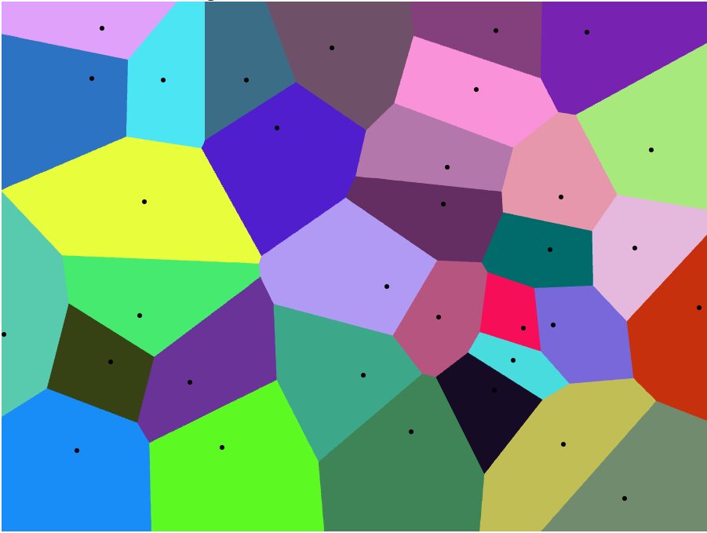

# Generating Techniques

Terrain generation is hardly uncharted territory.   In fact, this project is meant to be less about breaking new ground than it is integrating and implementing techniques to make a "good game" or "good simulation," ideally one that's easy enough to use that it can be repurposed and modified for other games, other simulations, and other environments.

Let's begin by going over some of the popular techniques.

## Noise

"Noise," in the technical sense we're using here, means a continuous function in one or more dimensions, that exhibit some random or pseudo-random properties.

For one-dimensional noise, think of it as a line that "wanders" between two values (typically either -1 and 1 or else 0 and 1) in an unpredictable fashion.  "Continuous" here means that if you were drawing the line, it could be done without lifting your pencil from the paper.

Of course, computers aren't great at continuous things, and this kind of continuity is broken if you're not thinking of the function as an infinitely-divisible line over real numbers.    In real implementations, this function is "sampled" at discrete, usually fixed intervals.    So long as the intervals are small compared the to average distances over which the function changes value ("period" or the "inverse frequency", if we think of the function as a signal), an illusion of continuity is maintained.   If the interval approaches or becomes longer than the period, the resulting output will show *moire* effects or break down altogether.  This is the same effect that makes fans and propellers appear to slow, then spin backwards when seen on film.

Probably the most famous of the computational noise generation functions is *Perlin noise*.  Developed for the movie *Tron*, it's been around for decades, and won its creator an Oscar for screen effects that used it.

Perlin noise generates "slow," smooth changes in value over the X axis.    These values are typically scaled from their [0,1] range into whatever is useful for a given application, and sampled at different frequencies in order to speed up or slow down the rate of change.

Early in its existence, it was noticed that Perlin noise at certain frequencies tends to look like a natural "ridge line" when viewed edge-on.   This effect is significantly magnified by sampling the Perlin noise function at several different rates (often called "octaves" in the literature), and adding or subtracting the resulting curves.

This effect persists when Perlin noise is extended to two dimensions.   When two-dimensional Perlin noise is generated over a range of (x, y) values, it produces a sort of "lumpy" or "cloudlike" pattern (very visible if you make an image of it, with each pixel given a greyscale value corresponding to the Perlin value at that position).    Again, sampling at different frequencies and adding the results together makes the clouds "fluffier."  

If you take that two-dimensional Perlin bitmap, and treat it as a *heightmap*, where the value indicates the "height" in the third dimension, you get something that often bears a remarkable similarity to natural terrain.    Messing with the scale, frequency, number of octaves, and interpretation can produce a wide variety of terrain effects, from rolling plains through dunes, hills, and mountains.    A huge amount of the "procedurally generated" terrains you see online are created directly from Perlin noise or a similar function.

### The Problems with Perlin Noise

#### Randomness

If the solution were "Perlin noise produces great terrains--we're done," this would be a short document, indeed.   But there are some downsides.

The first is technical.   Perlin noise describes a single, fixed function.   Assuming no bugs, your Perlin noise generator and my Perlin noise generator will generate the same function every time.   If you use it to generate a terrain, it will generate the *same* terrain each run.

Pseudo-random number generation has had this problem for ages, of course, and the solution there is to introduce a *seed* value, effectively a developer-provided starting point for the sequence (often itself derived from some near-random value like the microsection portion of the current clock time).

Perlin noise is unseeded, but we can fake the seed by simply offsetting the input value by a "seed" distance in the X or (X,Y) dimensions, basically just moving the "origin" of the Perlin function somewhere else.

There's a second issue with randomness, although it's not obvious until you look at some Perlin noise results for a while.   There's a distinct "grid" to it--that is, terrain features tend to appear in horizontal and vertical lines.   Whether or not this is a problem depends on the implementation; the "grid" is generally visible only when large amounts of the terrain are visible at once, so for a game where the player spends most of his or her time on the ground, it may never be obvious.

#### Simplex noise

Both of these problems are solved in a more modern noise function, called Simplex (also developed by Ken Perlin).  First, it takes an explicit seed, so you can generate repeatable or non-repeatable output as desired.  Second, it's built over a *hexagonal* structure rather than a gridded one, and with more deviation from those directions.   This generates far fewer visible "lines" in the resulting noise.  Simplex is also somewhat more computationally efficient, so it takes less computer time to generate.

A few specific implementations and uses for Simplex noise were covered by a U.S. patent, but there are a large number of non-infringing libraries and implementations available (e.g. "OpenSimplex"), and in any case the patent expired in early 2022.  Generally speaking, it's almost always better to use simplex noise rather than Perlin.

#### Natural-ish?

The biggest problem with both Perlin and Simplex noise is that while it generates some of the shapes and structures of natural terrain, the terrains described are only superficially "natural."   A geologist looking at noise-generated terrain won't be fooled, and even laypeople will tend to find it "boring" compared to real-world terrains.  "Sharp" features like geologically young mountain peaks, deep canyons, badlands, cliffs, and other features where sudden discontinuities are common aren't produced at all by most noise-based implementations, and require a lot of tweaking to achieve even if you're trying for them.  And of course, in the typical implementations, these are generating height maps over a 2D grid, so there are never any overhangs at all.

The last problem can be addressed in part by moving to *3D* noise, which is how games like Minecraft produce their bridges, overhangs, underground caves, and other features.   But even if you ignore the blocky-ness of Minecraft, its terrains are actually *less* natural looking than 2D implementations:  it covers more of nature, but at the cost of producing a lot of things nature never could.  And this sort of terrain virtually requires an expensive voxel implementation because of it's three-dimensional nature.

In the real world, mountain ranges tend to have foothills because colliding plates ripple like two pieces of gelatin shoved together.   Canyons are carved by rivers, and often still have them in the bottom.  Desert dunes are formed by the effects and direction of wind.   "Sharp" features in climatologically wet areas will tend to crumble and produce debris fields at the bottom.  Cliffs next to oceans or lakes will be undercut over time, resulting in sea caves or just collapse.   Hurricanes and tsunamis re-shape low-lying islands.    Unstable geology falls under gravity, structures become smoother and flatter as they (geologically) age.   Hot spots in the mantle produce "arcs" of volcanic mountains, caulderas, or islands as continental plates move over them.

Noise-based algorithms deal with precisely none of that.   They generate terrains that make sense locally but not globally.  One site discussing perlin-based terrains put it succinctly as "the terrain has no history."

None of this is to say that noise-based terrains have no place.   Sometimes realism isn't important.   Sometimes local is enough.   And almost always, you can use noise-based data to add realistic detail to terrains generated by other methods.

## Midpoint Displacement 

Another popular noise-like algorithm is "Midpoint Displacement."  There are numerous variations of this, but in general, the algorithm is:

- On a very coarse grid, choose (or randomize) some known positions to be your minimum and maximum heights.   These could, for example, be mountaintops, sea floors, etc.
- Subdivide the grid in both dimensions by 2x, basically adding a new position between each existing one in both dimensions.
- Set the height of that new position to the average of the 2/4 positions around it, plus or minus a small random displacement.
- Repeat until you're at the desired resolution, possibly halving the displacement each time.

This is a little more complex in practice than it looks like, since some of the positions need to be handled slightly differently than the others (there's a center square in each quad that has no neighbors with existing values when created), but it's relatively simple.

This doesn't generate quite as nice looking a terrain as the perlin/simplex versions, but it has the advantage that you can force certain positions to have certain values:  if you want to insure that the edges of your map are below sea level, for example, or that there are mountains/continents in specific places or quantities.

On the other hand, it shares a fair amount of disadvantages with the other noise methods:  the terrain tends to be either smoother or rougher in places than seems "natural," and it in general tends toward the smooth.   If you want a deep canyon with steep walls, for example, you'll need to place the high walls and the deep floor next to each other "manually," since they algorithm will almost always produce relatively shallow slopes.

Also, despite seeming fairly fractal, there's really only two scales:  the initial "gross features" one and the detailed "rough surface" one.  Everything else tends to get smoothed out between them.  It's pretty good (maybe better than any of the other algorithms) at creating the rough structure of continents and seas, but is much poorer at things like mountain ranges and hills, unless you provide them in the initial data (which sort of defeats the point).

# Voronoi

Voronoi diagrams are a sort of "region map."    A bunch of "seed points" are randomly distributed over a surface, and then every other point is assigned to the "region" containing the closest seed point to it.   The region edges are polygons, whose edges are along the exact midpoint between each pair of seed points.   This process effectively divides space into a random set of convex polygons.

For example, using Alex Beutel's online Voronoi generator [here](http://alexbeutel.com/webgl/voronoi.html), we can create an example diagram:

The seed points here are the black dots, and the various colored polygons are their associated regions.   Note that because they are distributed randomly, the seed points are often quite far from the center of regions they define.   Also note that every polygon is convex, and all of the edges are straight lines.   The size of the regions is defined by the density of the corresponding seed points; in the diagram above, sparser points on the left tend to lead to larger polygons than on the right.

Such diagrams can be used in several ways to generate terrains.