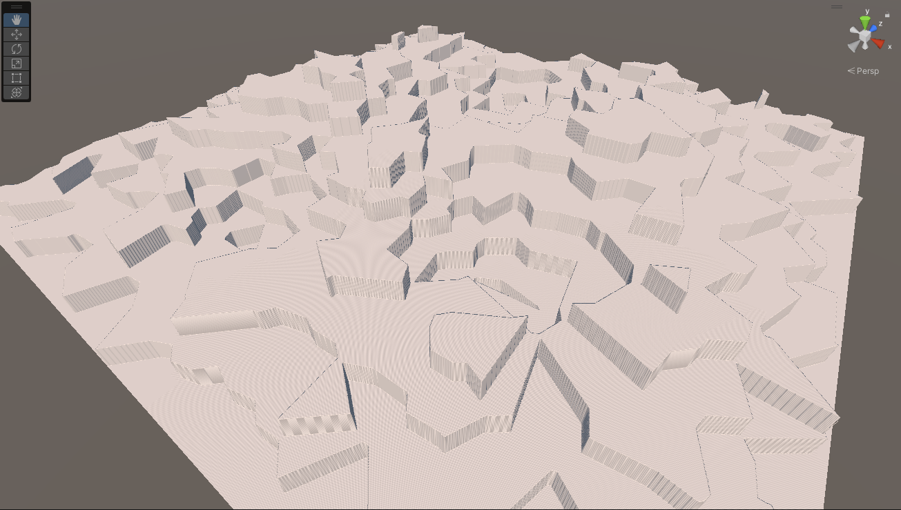
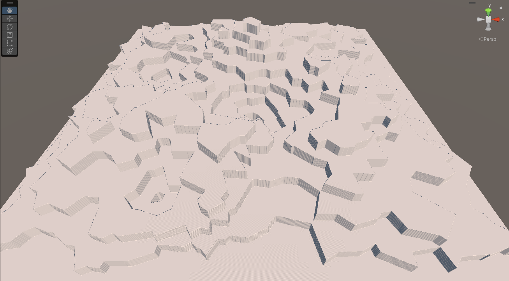
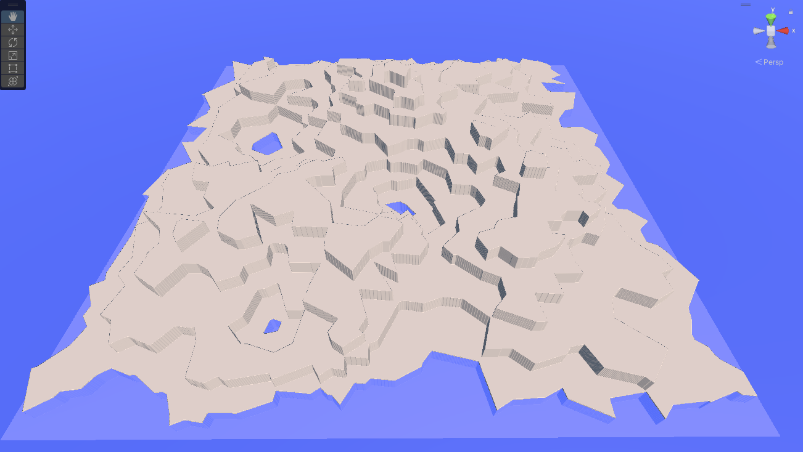
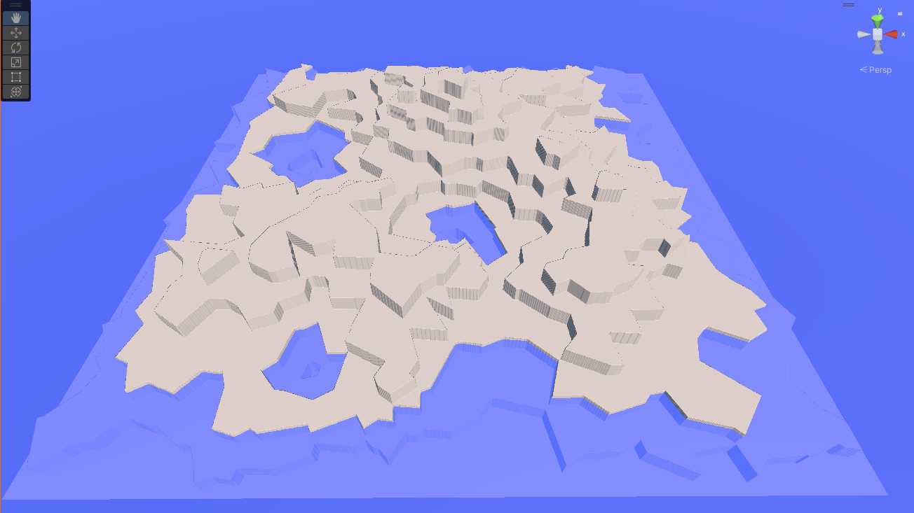
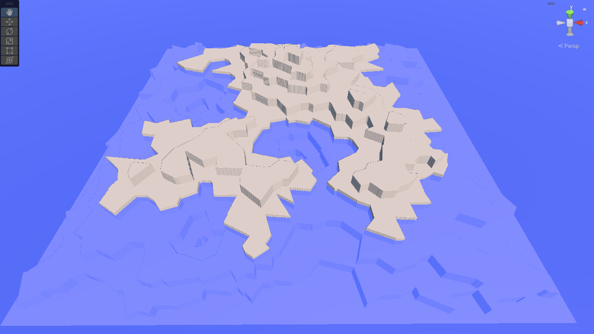
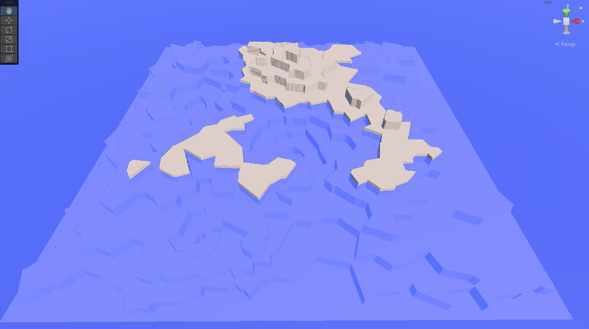
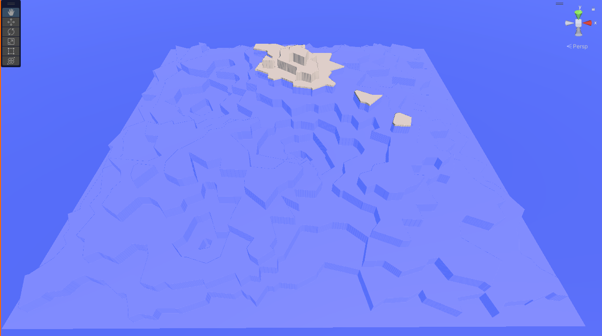
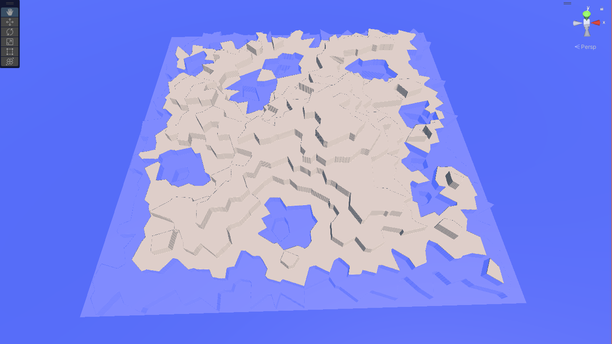
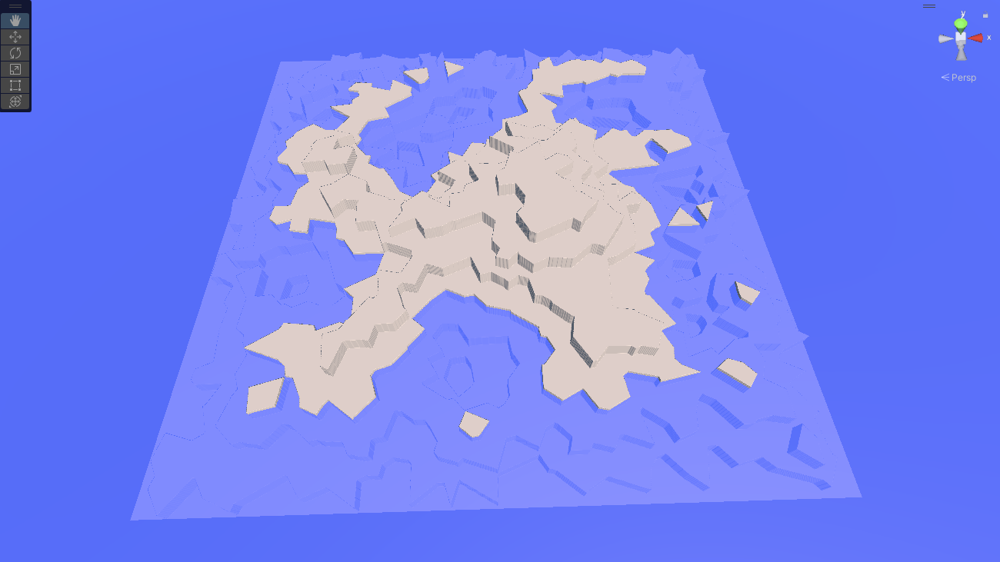

# Global Locality

At the global scale, we're concerned about shapes of things on scales ranging from several kilometers to continental.  Our primary concern here is to build the _Global Terrain Template_, a height map on a one-vertex-per-patch scale that will act as the backbone structure for the local maps that follow.

Once we've done that, we can use these geological structures to create additional templates for things like moisture, temperature, wind, weather, and biomes.    If we wish, we can also use them to generate political divisions for games and simulations.

## Global Terrain Template

The GTT will be sampled by the local patch generation maps to provide the rough structure that underlies that map.   For example, the GTT "cell" on a mountainside will have a fairly steep slope to it, the sampling insures that the terrain patch generated for that cell provides that slope.   The GTT essentially provides the contract for the local patches that are created.

More details on this process are found in the [Local Locality](local-loc.md) section.   Here, we're concerned with the generation of the global terrain template itself.

The template really need only be a height map; a two dimensional array of floats whose dimensions are basically just the dimensions of our world divided by the patch size.   But, especially while experimenting, it's nice to be able to "see" that height map as whole, so we'll generate a Unity Terrain object from it that we can inspect in the scene window while the game is running.    Using a Terrain for this map also let's us build the local stuff first if we want, since we can simply use Unity's terrain editing tools to make our "template" manually.

The downside of this is that we're limited by the maximum terrain size of 4096x4096 samples, but we can live with that until we're confident in our algorithms; at 1km patches, that's a sixteen million kilometer area for us to work with.   Still, we need to be aware of scale:  for game scales, that's way more than enough, but if our application needs real-world spaces, the surface of the Earth is something like 40 times that size.   Which means our algorithms need to accept pretty significant scaling and still work--either by actual scaling up to larger maps, or by allowing recursive decomposition to make higher resolution ones.

### Step 1: Generate Region Map

As always for Voronoi maps, we'll generate a bunch of random points.   True random tends to make "clumpy" points.  I'm OK with that, but if you want them a bit more evenly spread out, you can use *Lloyd relaxation* a couple times to move them about; you can find code for it in the Delaunay library in the [references](references.md).

We're not going to just store the points "raw," though.  We're eventually going to want to mark them up in various ways, so we'll build a structure containing a point and use that.

All we're looking for here is a sort of general elevation level.   We force areas we want to be underwater to be low (usually edges, unless your map allows the player to reach/cross the edge), and just rough out a shape for the rest of it.

The algorithm, in pseudocode, is basically this:

```pseudocode
Generate Random Voronoi Regions;
Assign every pixel in the heightmap a region.
Set the level of any region that touches an edge to zero;
Maybe set a small number of other regions to zero to encourage bays, inland seas, etc.
Set the level of every other region to at most one one level higher than any region it touches.
Map the "level" to a set of heights
```

There are a lot of magic numbers in this implementation:  how many Voronoi regions to generate, actual dimensions, how many "inland" points to push down, and the like.   It also takes a fair amount of time.   On my fairly high-end system (for 2022), it takes almost a minute and numerous iterations over each pixel to produce the map.  According to the profiler, the bulk of the time is in the initial assignment of each pixel of the heightmap to it's respective region.   With a geometry-based approach and a good flood-fill algorithm, that could be dramatically improved.

But once it's done, we'll have something like this:



That's a 2048x2048 patch terrain with 500 Voronoi regions and five randomly suppressed points.  (Only three are visible, one was cropped in on the bottom, and another was probably an edge region that was already zero).

Were not trying to do anything here except get the rough shape of a continent or two.  In particular, those high and low points aren't really meant to be mountain ranges and valleys, we're going to compress this down into something much smoother and flatter in a moment.

But before we do that, let's play around in the editor to demonstrate how we can use this to generate rough landforms.  Here's another map:



Here's that same map with a blue plane added above the first tier:



Using this, we get one large landmass with some small (well, relatively) inland "lakes."   Raise the level one more:



Our "lakes" are getting bigger, and while we've still got only a single continent, it's clearly starting to break into regions.   One more level:



Our lakes have become bays, and the "continent" has a more interesting shape.   Still another level:



We've got two continents now (and an ocean-to-land ratio similar to Earth).   If we go another level:



Our "continents" have become small islands in a vast sea.

Which of these (if any) is the ideal world for our game depends on the goals of the game, and in particular on whether or not sea travel (or undersea travel) is an important gameplay element.  If not, it might make more sense to increase the number of both terraces and "pushdown" lakes to break up the land "earlier" in the sea level rise path.   Here's a map with 700 regions and fifteen pushdowns, with the sea level at layer 2:



..or layer 3:



Either would make an interesting world for exploration, although this takes over two minutes to generate on my system, which is a long time to wait at the beginning of a game.

Next, we want to smooth this out a lot.   That, at least, is easy:

- First, our "terraces" are much higher than we need them to be; we'll just use a smaller multiplier.   

- Next, decide what our sea level is in terms of both heightmap level and number of terrace layers.   I pass this in as a parameter to the system, but you could just play with numbers until you find one you like, and hardcode it.

- Iterate across the map, setting the heights based on the sea level:  undersea ones below it, land ones above (*shell* here is the terrace number, and the 0.003f was just chosen by expirimentation:
  ```c#
  // For the moment, just set the heights in the terrain according to the shell number.
  for (int x = 0; x < dsize + 1; x++)
      for (int z = 0; z < dsize + 1; z++)
      {
          // Note reversed
          worldHts[z, x] = ((float)sealevel / (float)maxheight) +  0.003f * 
              (vregions[regions[x, z]].shell - numUnderseaTiers);
      }
  
  ```

- Finally, we'll run one or more Gaussian Blur filters over the landscape.   You can find code for this everywhere, but the algorithm is simple:  just replace each pixel's value with the average of itself and the pixels in a "window" around it.   It's exactly the same as the Gaussian Blur filter in apps like Photoshop, so if you're using an image library anywhere in your code, it might already be written for you.

```c#
// Performs a Gaussian blur over the specified window.
public static float[,] GaussianBlur(float[,] array, int dimension, int window)
{
    float[,] returnVal = new float[dimension, dimension];

    for (int x = 0; x < dimension; x++)
        for (int z = 0; z < dimension; z++)
        {
            float newVal = 0f;

            // If the window would exceed the bounds, just copy the existing value.
            // (Cheaper, but less accurate than doing a partial sum.)
            if (x < window || x >= dimension - window || z < window || z >= dimension - window)
            {
                returnVal[x, z] = array[x, z];
            }
            else
            { 
            for (int i = -window; i <= window; i++)
                for (int j = -window; j <= window; j++)
                {
                    newVal += array[x + i, z + j];
                }

            newVal /= (float)((window * 2 + 1) * (window * 2 + 1));
            returnVal[x, z] = newVal;
            }
        }

    return returnVal;
}
```

You'll want to use pretty big windows in your blur (I use 10 for the first pass), or else repeat it a few times.    When we're done, we'll have a terrain that rises and descends reasonably smoothly.    We've gotten rid of all the sharp discontinuities, and now we're ready to create some new ones!

### Step 2: Tectonics

Next up, we want to put back mountain ranges and rift valleys/trenches (a rift valley or ocean trench is a tectonic canyon caused by plate movement, vastly larger than even the largest erosion canyons.)

Earth has a lot of mountains, more than a million by some counts.  It's going to depend a lot on what you consider a "mountain" as opposed to a "hill."    The number of mountain ranges is even more difficult to define, but it's at least dozens.

Although mountain ranges are usually formed by tectonic plate collisions, many of Earth's mountain ranges--even some of the big ones, like the Rockies, aren't along the current edges of modern tectonic plates.   Plates merge, change shape, and divide over time, and the plates today aren't the same as the plates of a billion or so years ago.    So for an Earth-sized world, we'd probably want to model more than the 15 or so current tectonic plates.

Some of the modern plates run along the edges of continents (particularly along the western edges of the Americas), while other landmasses are just plopped in the middle of their plates somewhere.  Most plate edges don't run across land at all, although there are exceptions in the Middle East, Africa, and India, as well as Siberia and a few islands.

We don't really care about these details.   For our algorithm, we'll take a Voronoi map and place mountains and valleys along some of the edges.

We can use the Voronoi map we've already got (and in fact, we've already got smoothed discontinuities along many of the edges), or we can generate a new one and overlay it.    The former option will make mountain ranges and such tend to appear near coastlines and elevation changes, the second will make them more random.   It's a stylistic decision for a game, for "natural" worlds, the random one more closely approximates the real world (most mountain ranges are not along modern-day plate boundaries).

Generally the mountain ranges formed by subduction aren't right at the edge of the plates, either, but that doesn't matter for our algorithm.

