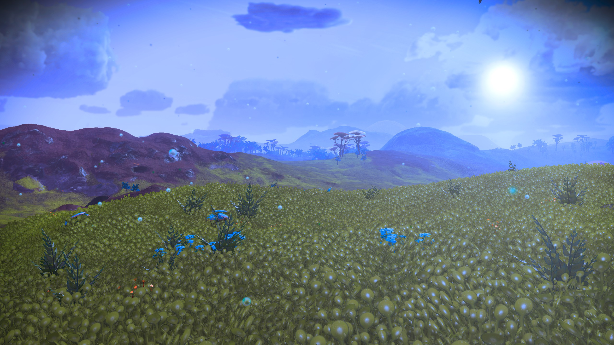

# Runtime Procedural Terrain Generation (in Unity)

## Alas, Unity, we hardly knew ye

So far as I know, there's nobody out there actually reading any of this, but just in case, here's a final update.

In mid September of 2023, Unity (the company) basically imploded; pushing out a revenue model that would have been disastrous for indie developers, retroactively counted installs for a new going-forward fee _on existing games_, changed their terms of service (also retroactively), and repeatedly lied about it.

There was, to put it mildly, anger in the dev community.   As Unity's share price plummeted and the news cycles revolved around developers announcing they were leaving Unity for other platforms (mostly Unreal Engine, but for a few indie developers, Godot is far enough along), Unity walked back as little as they could get away with, but even after a replacement CEO and layoffs, are still going forward with the "runtime fee," albeit modified slightly so that the cost doesn't turn out to be _unlimited_ in the case of a mild unexpected success.

Unity has (or had, at least, there's no way of knowing what their numbers look like now, since they're not giving stock guidance any more) a significant developer presence.   They more or less owned the mobile game development market and held a significant share of the indie games, as well.    For developer just learning their trade, Unity's C#-based engine was a little easier to learn than the C++-based Unreal Engine.    Their engine isn't as good as Unreal Engine, and few triple-A titles used it, but for many games--even pretty big names--it was good enough.   Similarly, Unity is infamous for constantly changing recommended practices while leaving the previous recommendation 70% done:  there are currently something like five rendering pipelines, two different UI systems, two different networking systems, two different control systems...none of which are "complete" without significant workarounds.    And they've been recently pushing into a "DOTS" system that basically throws away almost _everything_ in favor of a new "but this time it's better!" model.    Still, the price used to be right, and at least they were giving you options.    But they needed a laser-like focus on game engine technologies and people, but instead were internally hijacked by a focus on borderline predatory monetization tools that seemed to suck all the air from their engineering efforts. 

It might have been, and might still be, possible for Unity to recover from this.   My intent was to go back to Unity to start implementing some of this stuff on the new Apple Vision Pro, and see if their supposed refocus on their tools was real or not.    But Unity had one final gasp of greed, and—despite receiving significant marketing and support from Apple as the "premier game engine" for the Vision Pro—decided to lock it behind a multi-thousand-dollar per year paid license; effectively pricing it out of reach of independent devs entirely.   

That's \$2K per year, per developer, and eliminates the "you don't pay until you go over \$100,000" zone that made it the choice of beginning devs everywhere.   A small two-person team would pay more for Unity than they did for the Vision Pro hardware itself--every single year, whether they shipped anything or not.

(As an aside, a month and a half after the Vision Pro shipped, I'm seeing almost no Unity-based software on it; the reason for this isn't clear, but none of the possibilities are particularly encouraging toward it's value in developing Vision Pro software.)

I'm not a beginner dev (although I'm relatively new to game tech), and I know C++.   Even if I weren't, the C++ mechanics that Unreal Engine uses aren't much harder to learn than C# is, and the engine is all-around better.    And it's shortly going to start shipping its own support for the Vision Pro, _not_ with additional fees.    Given Unity's repeated lack of trustworthiness and focus on its core tools, I'd be insane not to switch.

And so that's the bottom line, at least for me.      I'll transfer as much of my knowledge and assets as possible over to Unreal Engine, and continue from there.   But it also means this particular project will go no further, at least not in Unity.  The "terrain" objects in Unreal Engine are very different, and I'm not sure yet how much will transfer.   We'll see.

If you _did_ read all this, thank you for coming along for the ride.

--Christopher Kempke, March, 2024

{{ blog_content }}

## Update, September 2022

I like books.   I don't necessarily mean the physical, dead-tree artifact (although I like those, too), but rather the _format_.   Books have a beginning, a middle, and an ending.  For nonfiction, they separate topics, explore them to whatever depth they're going to, and then move on to the next one.  It's easy to find what you need in a convenient table of contents, and in well-written material, there's a general flow of information from easiest to hardest, or at least they present each part in an order that builds on the previous ones.

Most of all, Books are static.  Sure, there are apparently enough discoveries in basic Calculus every year to merit a new edition of every textbook, and certainly books are revised or replaced over time.  But at a given point in time, they're stable.

This project (and in fact all development) isn't.   Software development is an iterative process; experimental development doubly so.   The order in which things are implemented is unlikely to match the order in which you'd present them in a book.

I've been trying to present this material as a sort of online book.   And for me, it's working fine.  But I'm hoping that this isn't just a solipsist effort—that there are people out there reading it.   And for them, this presentation sort of sucks.    The main issue is that the process is _globally_ iterative.   I make changes to the global terrain generation, then some local changes, then some regional ones, then more to the global generation, and so on and on.

When I make changes, I go back and add to the sections that I've presented.    But that creates a poor experience for the reader.   Partly it's just time dissonance:  you'll see screen shots that are from later in the process than ones that occur later in the book.   But more importantly, unless you're reading this from (virtual) cover to cover every day, you don't know when I've updated a previous section.  It's never "done," and there may well be people trying to "follow along," but there's no good mechanism for knowing when more content is available.   Consider this very section, in which I had to put a huge label at the top.

So, while I'm not giving up on the "book" idea; I think that format is best for the postmortem stage, when new information has dropped to a trickle.    During the actual development, I'm going to move over the next few weeks to something more like a diary or a blog, probably using the same software I am over in my [actual blog](https://ckempke.github.io/Blog).   As I add information, it'll be at the top, and I'll use tags and such to categorize where things will eventually go in a potential "book form".   It'll likely be longer-form than most blogs, but that's OK.      The pages that are already here will be moved into blog articles; if you read from bottom to top, you'll get the existing information in its existing order. But new stuff will be at the top, always accessible, and I'll limit the edits to the existing material to things like grammar, spelling, typos, and adding the occasional pointer to something newer.

Stay tuned

   ---Chris

## Introduction

_Note:  This is a very long, multi-page document.   If you're not seeing it as such, you're probably using a relatively small browsing window, and the navigation is hidden in a hamburger menu.   You can also use the "next page" / "previous page" buttons at the bottom of the screen, and in many browsers (if you've got a keyboard), "N" and "P" (or "," and ".") will navigate as well.   If your reading environment can make the window sufficiently wide, you'll get navigation outlines on both sides of the text (page selection on the left, contents within a page on the right)._

I've always loved open world games, with their illusion of complete freedom of movement in a vast world ready for exploration.    And as a developer, I've similarly been a fan of _procedural generation_ of game environments: the notion that the game can—through application of rules—generate its own content.    In the best scenarios, this gives way to _emergent behavior_, in which those rules combine in ways that are more than the sum of their parts, and can produce results (pleasantly) surprising even to the developer.  (Contrast with _bugs_, which are results unpleasantly surprising to the developer...)

The logical endpoint of this are games like _No Man's Sky_, in which virtually the entire world is procedurally generated, like this:

As a developer, one of the attractions of such systems is that a small team--perhaps even an individual--can create a "large" game in this way.   Since, despite what the scale tells me, *I* am an individual, and I've now got time to look into projects like this, I'm combining an effort to learn the Unity game engine with a desire to push some boundaries of procedural design.

So *what is this site, anyway?*  Well, it's something between a reference, a blog, and a developer diary as I play around with building terrains.    I show only snippets of code, but if you want the actual code in whatever state it's in, send me an e-mail.  You'll notice that it's a little disordered; some sections just sort of trail off until I implement the next part of them, when I go back and add more content.   The physical organization is meant to be readable rather than either strictly lumping topics together or chronological.    And I keep tweaking it!   Will this turn into something more than some musings on the web?   Who knows?   That's the wonder of it.

Another wonder of the modern Internet is that you never know who's going to wander by, courtesy of Bing, Google, or the world's most specific typo.    If you're looking for me, contact information is over at https://www.chriskempke.com, or use email to "ckempke" at the domain mac.com.

--Christopher Kempke

## Tools

This site is being hosted at GitHub Pages, but it's not using their Jekyll parser.  Instead, I'm using MkDocs, with the Material theme, and with the Mermaid extensions turned on.

Mermaid allows graphs such as flowcharts and sequence diagrams:

I also enable KaTeX, which allows both inline ($c = \pm\sqrt{a^2 + b^2}$) and callout LaTeX mathematics symbols:

$$
\mathbf{V}_1 \times \mathbf{V}_2 =  \begin{vmatrix}
\mathbf{i} & \mathbf{j} & \mathbf{k} \\
\frac{\partial X}{\partial u} &  \frac{\partial Y}{\partial u} & 0 \\
\frac{\partial X}{\partial v} &  \frac{\partial Y}{\partial v} & 0 \\
\end{vmatrix}
$$

Docsify itself parses Markdown files of various sorts to produce the HTML display you're looking at now, including the sidebar to the left (or in the hamburger menu if you're browsing on mobile) and the live text search.