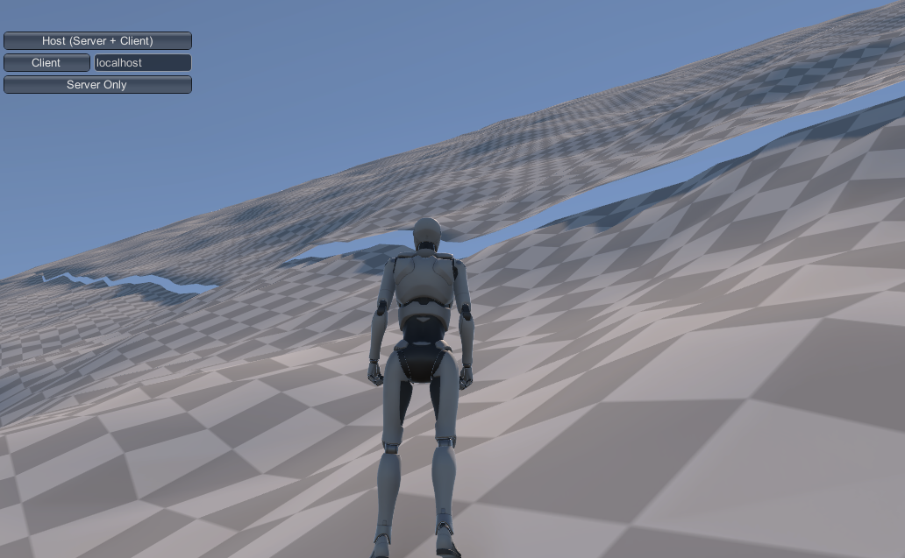
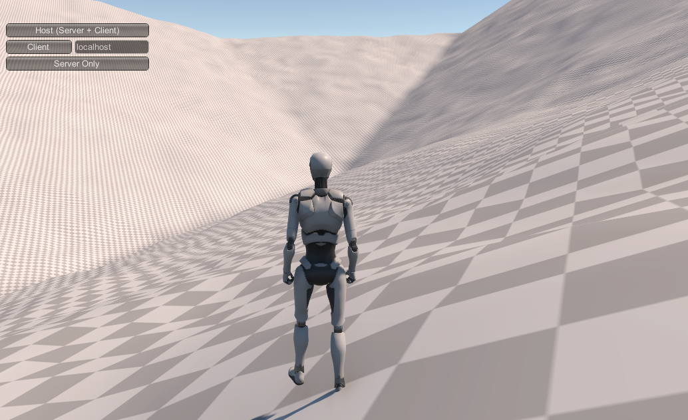

# Local Locality

At the other extreme of our maps, "local" patches generate the terrain that the player actually interacts with, traverses, potentially even manipulates.

## Base Level Generation

The first step in generating a patch is to figure out where that patch is in relation to our larger world.    The Global Terrain Template is a height map with very coarse sampling:  the height vertices are spaced at the same distance as a single local patch covers.   That is, if our local patches are 1024 meters wide, there will be one height vertex for ever 1024 meters.

Since patches actually represent the spaces between vertices (much as the polygons of a Terrain object define the actual surfaces of that terrain), each patch is influenced by four vertices of the Global Terrain Template: one at each corner of the patch.   Two of these corners are shared with every horizontally or vertically adjacent patch, and one corner with every diagonal patch.    This sharing of data between adjacent patches is what allows us to generate them independently.

The first step is to create the _base level_.   That's effectively a heightmap for the terrain that just implements two large triangular regions, one connecting the lower left, upper left, and upper right corners of the terrain, and one connecting the upper right, lower right, and lower left.   You could also divide the terrain along the other diagonal, but doing it this way makes the test for which of the two triangles a given point represent as easy as testing if its (local) X value is greater or less than it's Z value.

From a distance, this will look like tessellation.   Because it's possible (in fact, likely) that the four corners of the patch cannot share a single plane, two triangles are the minimum "flat" representation.

The process of generating base heights for each location in the patch is relatively simple given the right mathematical tools:

```pseudocode
for each x
   for each z
       if (z >= x)
          set height based on a Barycentric weighting from each of the ll, ul, ru corners
       else
          set height based on a Barycentric weighting from each of the ur, lr, ll corners
```

_Barycentric weighting_ is easily found on the Internet (search "Barycentric coordinates").   It's the same process used in "vertex shading" (aka Gouraud shading) and other pixel-mapping-from-a-vertex processes, where the value of something at a point *p* in a triangle takes on a weighted average of the value at each of the triangle's vertices.   The value depends on the distance to each corner, with closer corners contributing more value.

But what you'll find on the Internet is academic papers and academic blog discussions, describing the process in equations and vectors.  It's surprisingly difficult to find actual _code_.    The best I've found are references to the book *Real-time Collision Detection*, by Christer Ericson.    That code is in C++ and not defined in terms of Unity types, but translating it to C# isn't hard:

```c#
// Compute barycentric coordinates (u, v, w) for
// point p with respect to triangle (a, b, c)
public static Vector3 Barycentric(Vector3 p, Vector3 a, Vector3 b, Vector3 c)
{
    Vector3 v0 = b - a, v1 = c - a, v2 = p - a;
    float d00 = Vector3.Dot(v0, v0);
    float d01 = Vector3.Dot(v0, v1);
    float d11 = Vector3.Dot(v1, v1);
    float d20 = Vector3.Dot(v2, v0);
    float d21 = Vector3.Dot(v2, v1);
    float denom = d00 * d11 - d01 * d01;
    float v = (d11 * d20 - d01 * d21) / denom;
    float w = (d00 * d21 - d01 * d20) / denom;
    float u = 1.0f - v - w;
    return new Vector3(u, v, w);
}
```

The output vector contains the weights for point a, b, and c in that order.  These are normalized -- the three weights always add up to 1.0--so you can just use them as multipliers directly:

```c#
float upLeft = templateHeights[templateindexZ+ 1, templateindexX];
float upRight = templateHeights[templateindexZ + 1, templateindexX + 1];
float downLeft = templateHeights[templateindexZ, templateindexX];
float downRight = templateHeights[templateindexZ, templateindexX + 1];

Vector3 ulVec = new Vector3(0, 0, 1);
Vector3 urVec = new Vector3(1, 0, 1);
Vector3 dlVec = new Vector3(0, 0, 0);
Vector3 drVec = new Vector3(1, 0, 0);

for (int z = 0; z < worldGen.terrainTileSize + 1; z++)
    for (int x = 0; x < worldGen.terrainTileSize + 1; x++)
    {
        if (z >= x)
        {
            // Upper Left half
            Vector3 b = Barycentric(new Vector3((float)x / (float)(worldGen.terrainTileSize + 1),
                                                0,
                                                (float)z / (float)(worldGen.terrainTileSize + 1)),
                dlVec, ulVec, urVec);
            result[z, x] = b.x * downLeft + b.y * upLeft + b.z * upRight;
        }
        else
        {
            // Lower Right  half
            Vector3 b = Barycentric(new Vector3((float)x / (float)(worldGen.terrainTileSize + 1),
                                                0,
                                                (float)z / (float)(worldGen.terrainTileSize + 1)),
                dlVec, urVec, drVec);
            result[z, x] = b.x * downLeft + b.y * upRight + b.z * downRight;
        }
    }
```

Note that this calls *Barycentric()* for every point in the heightmap, and we do this for every heightmap we generate.  There's an old computer programmer saying:

> Premature optimization is the root of all evil.

I'd like to add my own to it:

> ...but there's no need to be stupid.

In this case, we're doing a lot of work repeatedly.   Some of it is easy, like the cast of _worldGen.terrainTileSize + 1_ to float that could be pulled out of the loop.   But most of it is inside *Barycentric()*.   That is the "in a vacuum" case given above.   In context, we can see that for every point in a given triangle, the only thing that varies in that function is _p_, which means that any line that doesn't use _p_ or variables which are calculated from it--about half the function, including the first three dot products and the denominator calculation--could be done once and applied to every point in a given triangle.   That optimization alone would reduce the cost of this process by half--I leave it up to you whether that's worth the significant cost in readability (and by extension, maintainability and reusability).  But I will say, if you *have* to prematurely optimize, you could do a lot worse than reducing the cost of the inner code of a double nested `for` loop.

When this process is done, you'll have terrain height values that smoothly spread the rise or drop across each of the two triangles.   The corners will be in the exact position of the template heights, and the edges will interpolate between them.  Importantly, when adjacent terrains do this same algorithm, they'll generate the same values (give or take floating point rounding) for the edges and corners, so they'll still line up, without our having to reference the other patch's heightmap.  So we've maintained independence of generation.

That rounding gets worse the "higher" we go in our game world, and the steeper the slope, so some stitching is going to be inevitable.   I've found that 8K as a global maximum height produces edges that are off on the steepest, highest hillsides by about a quarter meter vertically.   In flatter terrains, there's usually no visible gap at all, and the occasional one is a few centimeters in height.     Even the quarter meter ones should be easily stitched without requiring a skirt zone.



Another downside is that our terrain is effectively flat (or at least smoothly sloped) except for a possible discontinuity along the center line if the two "triangles" that make up the terrain are significantly different in slope.    We're "correct" in the global function (rising toward mountains, falling toward plains, etc.), but quite uninteresting in the local space.

And those centerline discontinuities can be pretty obvious.  Here our robot is overlooking a valley corner where 3-4 of these barycentric lines come together:



Even after applying noise (see below), those are some fairly straight lines (and the shadows emphasize it in the image).   Generally, this would indicate a failure of our global generation system - these discontinuities appear only in places with fairly sudden changes in global elevation slope, which is a pretty unnatural case to begin with.   But if we need to support that, the solution is to add some variance into our base elevation "triangulation."   Other than the corners and edges (which are necessary in order to align with connecting patches), there's no particular reason our "centerline" needs to be a line, and by replacing it with something like a weighted random walk (or repeated midpoint displacement), we can make that shape much more interesting.

### Patch Size and Steepness

There's a subtle relationship in this algorithm between the size you use for patches (1024x1024 in our examples) and the maximum steepness of our terrains.   Theoretically, the steepest surface you can have is a terrain that reaches the minimum and maximum world heights in a single patch.   The absolute height that can be reached is unchanged depending on patch size, but the rate at which you can "get there" isn't.   A 1km patch can achieve its elevation gain (assuming the base heights algorithm and ignoring local features) over a full kilometer.   A 250 meter patch can be four times as steep, just because it's edges are a quarter as far apart.

Going from sea floor to maximum height in a kilometer isn't likely to happen, of course, but this same logic applies to any elevation gain:  they can be steeper with smaller patches.

With a 5K maximum elevation and 1K terrain patches, even pretty "mountainous" slopes can be walkable using Unity's default 45-degree rule, although that that rule is fairly unrealistic.   Humans can't really walk up 45 degree slopes in anything like a normal gait.  If you want steeper ones, you can, of course, raise the maximum elevation; but an easier solution is just to lower the patch size -- this gives us more flexibility for platform support (particularly mobile), as well.

## Adding Interest

We've got a lot of tools remaining to apply, including biomes with detail and vegetation, as well as features applied at the regional level.   But before we get to all of those, it makes sense to use the easy one:  Perlin (or rather Simplex) noise.   While noise generates pretty mediocre terrain _by itself_, it makes an excellent "roughening" agent for covering up overly-regular structures, and it doesn't get much more regular than our base height map.

We don't need _much_ noise; just enough to break up the ground a little and not make the user feel like they're walking on a gradually terraced plain all the time.  And in fact, we don't want too much noise, because we need to be able to apply this _everywhere_ in order to keep edges aligning.

For now, those two algorithms (base height plus noise) will be enough to give us decent terrain shapes that define our local patches in terms of their global context, and look fairly natural doing it.   We'll add more later, but right now, we've got the beginnings of a world. 