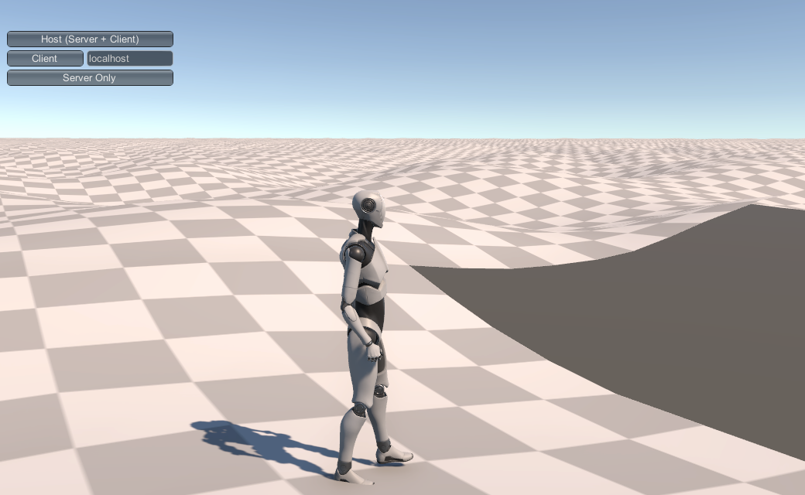

# Locality

For our implementation, we're considering worlds that are very large--much larger than could reasonably be held in memory, and even much larger than could reasonably be stored on disk.

While we'll take literally infinite sized worlds off the table for the moment, generating even a 1000x1000 km world (about  a tenth the size of the United States or China) would take more than four terabytes for the height values alone at 1 meter resolution, not even considering any textures or auxiliary data.

Further, the player isn't likely to need detailed access to nearly that much space.   Assuming our game allows flight, it's not at all impossible that the player might _see_ all that space from great distances away, but they're not going to be wandering around chopping down trees, fighting monsters, opening chests, or talking to NPCs in more than a tiny, tiny fraction of it.

So the huge tool in our toolbox here is going to be on-demand generation.   We'll want to generate only those areas we need to in order to fulfil some player need: certainly the terrain immediately around them, and maybe rough terrains for very large features like oceans and mountain ranges, but at any given moment, effectively all of the world will be unneeded.

This gives is a bunch of benefits:

- We only generate what we need.  If the player never goes someplace, we don't need to generate it (at least not in detail).
- We only need to keep the immediately-relevant part of the terrain in memory.
- When a player _leaves_ an area, we only need to store any changes they made there; if they return, we can always just regenerate it and re-apply those changes.
- If a player's changes to an area are minor, impermanent, or separated significantly in time, we don't need to store them at all, we can just regenerate the area "clean" when (if) the player ever returns.
- We can "change the rules" dynamically.   If the powers of chaos are darkening the skies, withering the trees, and making the rivers run with blood, we can fade these effects in over time as we generate or re-generate terrains.
- The player doesn't need to wait for us to generate and store one million square kilometers of terrain before they can begin playing.

## Requirements

OK, but to get all that, we need to follow some rules and solve some problems.   To help us talk about them, let's give a name to our "generation units": a _patch_ or _terrain patch_.

For our implementation, let's assume that our terrain patches are about a square kilometer: 1024 x 1024 meters on a side (height maps in Unity have to cover power-of-two area, so we'll just go with it.)   The exact size doesn't matter, and in fact we may need to experiment with values to find one that works across our desired platforms.     1024x1024 gives us 1025x1025 vertices, each holding a 32-bit float height value, for just over 4 MB per patch in height data.   Even on most mobile platforms, that should be manageable; if not, we can reduce to 512x512 or even 256x256 meter patches for corresponding reductions in size.    But we'll assume 1024 for now.

### Independent Generation

So our first requirement--the one that we'll be spending more effort on than any other--is that we need to be able to generate these patches independently of each other.    That is, the contents of our patch must be able to be generated without requiring that we've already generated the patches adjacent to it.   Obviously this is helpful for multiprocessing (independent patches can be generated in any order and on demand), but it's more critical than that.    If our patches are _not_ independent, then generating a patch requires generating the patches around it, which requires generating the patches around those...and we're back to needing to generate the entire world.

Independent generation does not mean that patches need to be generated in a complete vacuum.   The generation process can "know" things about the surrounding patches and its own place in the world, it just can't require that those adjacent patches actually exist.

For example, let's consider a very easy case:  we'll generate our entire world from Perlin/Simplex noise. 

```c#
 public WorldPatch(WorldGenerator worldGen, long worldllx, long worldllz, float localllx, float localllz)
        {
            _localPosition = new Vector3(localllx, 0, localllz);
            _position = new double[3] { worldllx, 0, worldllz };
            _longPosition = new long[3] { worldllx, 0, worldllz };
            
            TerrainData td = new TerrainData();
            Vector3 tdsize = td.size;
            tdsize.y = worldGen.maxheight;
            td.size = tdsize;
            td.heightmapResolution = worldGen.terrainTileSize+1;
            td.baseMapResolution = worldGen.terrainTileSize + 1;

            float[,] result = Noise.Calc2DPatchInvert(worldllx, worldllz, 
                                                      worldGen.terrainTileSize + 1, 0.06f, 0.0005f);
            td.SetHeights(0, 0, result);

            terrainGO = Terrain.CreateTerrainGameObject(td);
            terrain = terrainGO.GetComponent<Terrain>();

            terrainGO.transform.position = new Vector3(localllx, 0, localllz);
            terrainGO.transform.SetParent(worldGen.gameObject.transform);
       }
```

This code takes a "WorldGenerator" and global and local (X,Z) base coordinates.   We'll talk more about those in a minute, but for right now, just assume that *WorldGenerator* is a structure with some "global" constants and such in it.

Most of this is just boilerplate; we'll expand and improve on it as we go.   But these two lines are critical:

            float[,] result = Noise.Calc2DPatchInvert(worldllx, worldllz, 
                                                      worldGen.terrainTileSize + 1, 0.06f, 0.0005f);
            td.SetHeights(0, 0, result);

_Calc2DPatchInvert_ is a simplex noise generation function.   The exact details don't matter, but note that it takes the position of the patch ("WorldPatch") as arguments.   The 2D Simplex function uses that position as the (x,y) position to start from in it's noise space, and returns a two-dimensional array of [terrainTileSize+1,terrainTileSize+1] height values.    This code is sufficient to generate an entire, seamless world:  each patch is located exactly terrainTileSize distance apart, so each patch's Simplex noise "picks up" exactly where the previous one left off.

Here's a screenshot of a character standing at the corner of three patches, one of which hasn't been generated yet.  Notice that the three existing patches blend smoothly at their edges, there are no gaps or "spikes."

 

The problem, though, is probably already obvious:  this isn't a very interesting world; just meter-high rolling hills to the end of infinity (or at least the end of the integer coordinate space).

Part of this is that we're just using a very simple noise function.    Usually Perlin-class noise functions add several different "octaves" (scales) of the noise together to get a rougher terrain.   The technique is called _fractal Brownian motion_ (FBM), which I personally think is a horrible name, because (while accurate), there's no actual "motion" here, and it's very different from what we usually think of as Brownian motion: the random walk of individual particles in something like a liquid.    I'm just going to call it "fractal noise," and accept that the Nobel committee will probably overlook me.

We could use fractal noise to generate a much more "rough" terrain by letting it generate features ranging in size from the sort of local hills we've got here through the size of the entire world.     But pure Perlin-class noise generation doesn't generate very interesting worlds at the best of times, and so we probably want to reserve it as a final "roughening" step after we use some other technique.

The other issue with Perlin-class noise terrains is that they need to be uniform between patches.   If the frequency changes between two patches, the "position" of hills and depressions will move around, and a "hill" that begins in one patch will likely be somewhere else (or missing altogether) in the next, and this will increase the further you are from the origin.   Similarly, amplitude changes will cause features to have different sizes (but not positions) between patches, also causing discontinuities and gaps.  Stitching can probably cover minor differences, but attempting to generate a wide range of different terrains with varying Perlin-noise is going to make for a lot of blending problems.

### Local and Global

And this is where it starts to get ugly.   Consider a mountain.   Mountains are generally much, much larger than a square kilometer, and are often in mountain ranges which are larger still, and characteristically have foothills rising up to that range, which cover more area still.    

That mountain has an influence over patches potentially hundreds of patches away.   My "foothill" patch needs to do it's part in the rise from plains to mountain range, even though that mountain range is very, very distant.  And in fact, my patch will "care" what's in the other direction, too.   If there's a second mountain range on the other side of us, we'll likely generate very different terrain than if the land falls off to the sea (look at a relief map and notice that subduction mountain ranges tend to "fall off" much faster on one side than the other.)

So it seems like we need to know about, say, every mountain in our world to generate every patch.   And probably every valley, canyon, lake, river, road, etc. over a certain size.  That's the very opposite of independent generation.

On the other end of the scale, say there's a ten-meter pond in our patch.  If it's entirely within the bounds of our patch, no problem.   But if it spills over into the next patch, we don't want it to simply end in a hard line at the patch boundary.   We could solve this--very simply--by having small features like that always generated inside patch boundaries; but there are problems with that solution, too:  players may well start noticing a sort of "grid" layout to some feature types, it's clumsy to use with features of different sizes, it doesn't work for things near or slightly larger than a whole patch, and it gets even more limiting if our patch sizes need to get smaller to support mobile or older consoles. 

Then there's the stuff in the middle: that ten kilometer mountain lake, the sheer cliff that runs for a few kilometers, a swamp contained in the caldera of an extinct volcano, or even a small cinder cone volcano itself rising out of an agricultural plain.

And while we're solving all these problems, we still want to have our patches be able to be generated independently of the ones adjacent to them (and to match them at the edges, at least closely enough that we can cheaply stitch them.)

The world tends to be fractal:  that is, structures repeat in spirit (not exact shape) at many different scales: coastlines share their ruggedness no matter how far you zoom in and out, erosion builds the same patterns in great hills and canyons as it does in your dried backyard dirt piles, desert dunes are recursive in shape.

But for _our_ purposes, we can try to simplify this into four categories:

- **Global** structures are those that are vastly larger than our patches:  the shapes of continents, mountain ranges, oceans, supervolcano calderas, (large) impact craters, and the like.  Anything whose structure spreads over more than maybe 2 or 3 kilometers in any direction, we'll consider global.
- **Regional** structures are those that affect a small number of nearby patches:  a single hill, small volcanic crater, small to medium lake or island, smaller impact craters, buttes, valleys, rock outcroppings, glacier, or something like Devil's Tower.   The specific criteria here is that their influence or physical structure must be contained within a small number of patches: say 5-10 at the absolute most.   We'll also assume that they get rarer as they get larger.
- **Local** structures are those that are smaller than a single patch:  the "lay of the land" itself, plants, trees, cave entrances, small hills, etc.  These will often be entirely internal to a patch, and must never impact more than the directly adjoining patch(es).
- **Network** structures are rivers, roads/paths/natural trails, and long erosion paths (think the Amazon or Nile Basins or the Grand Canyon).  Typically long, thin things that have a beginning and end, and can join with others of their kind in a sort of branching structure, and often get wider or narrower in different areas.

Each of these will require solutions separate from the others, so let's get started.

