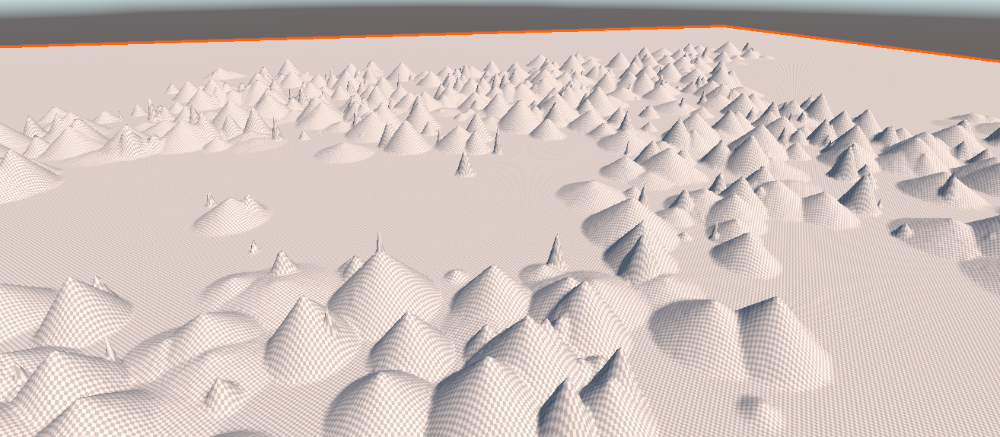
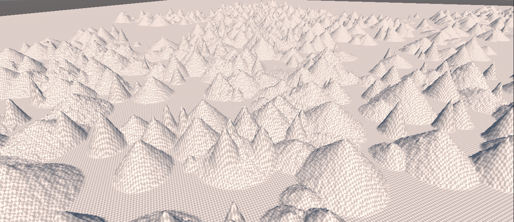
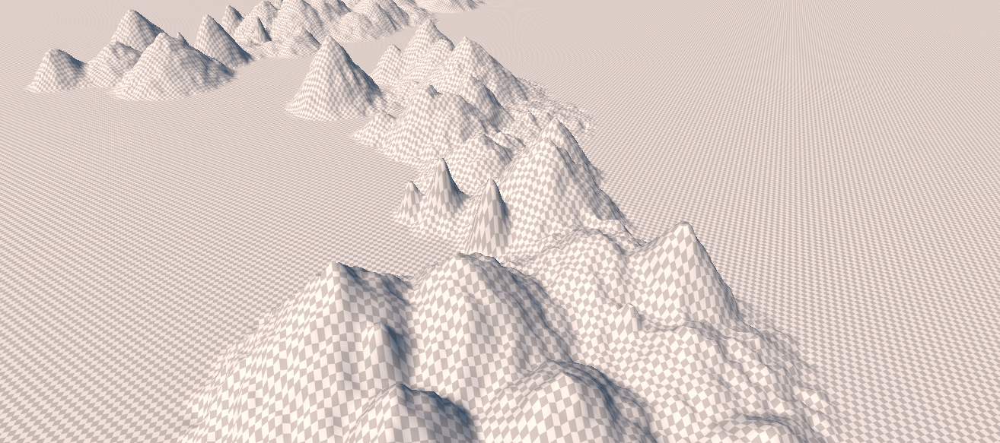
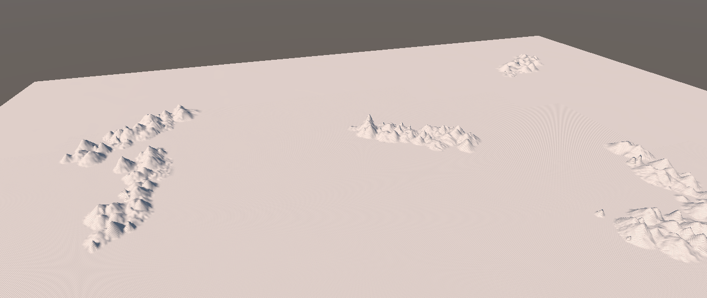
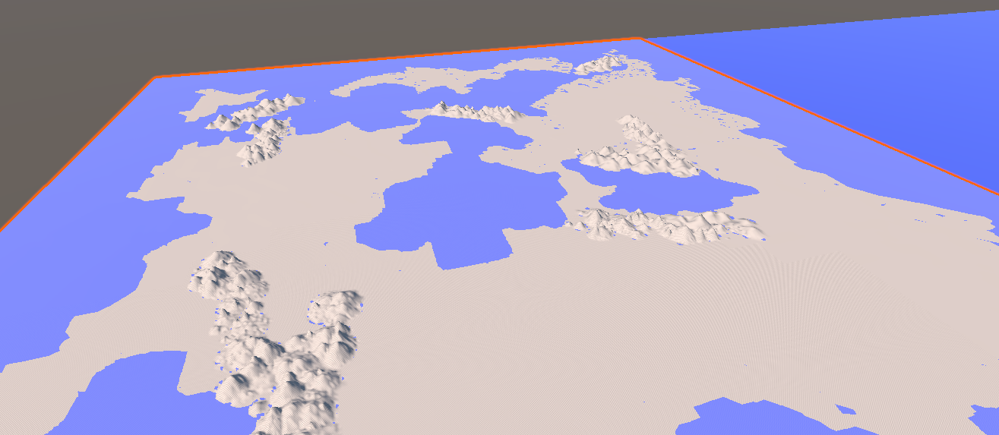

# Global Features

It's time to add some features to our global terrain Template.   Here, we're only concerned with features that are vast relative to a tile.   That certainly includes mountains, mountain ranges, and rift valleys, but also might include standalone volcanoes, craters, ice caps, and even major rivers, if our world has these things.

## Mountains and Ranges

We'll start with mountains.  As massive, geologically ancient structures, mountains get much of their character and shape from erosion, which we'll discuss later.   Right now, we're just trying to sketch in the basic shapes.

There are a few standalone mountains (particularly volcanoes) on Earth--and fantasy worlds tend to love having "lonely mountains" of one sort or another--but generally mountains appear as part of mountain ranges.

For our purposes, a mountain range is a rough line or arc of mountains, from a handful to hundreds.  

The Andes, Earth's longest mountain chain on land, has about a hundred peaks of 6000 meters or more.  The Andes are also interesting in another way; they run for almost 7000 km along a tectonic plate boundary, making them also likely one of the youngest mountain chains in the world.   

We're going to ignore "plate" edges and skip the Voronoi step.   Our mountain range algorithm will just pick two endpoints within a specified range of distances apart, and put a bunch of mountains between them.

#### Mountain Map

We're going to make a **mountain map**, and keep it around.   This is a two dimensional float array of values that are all initially zero.   We'll draw our mountains and valleys onto that map in the range -1 to 1, and then _add_ that map to the existing terrain heights map to actually "apply" our mountains. 

Why?   It's a little easier to work with a constant height system, but the key reason is that we're going to want to be able to find our mountain ranges later, and having an array that's all zeros except for the mountains and valleys  will make that process easier.   We'll eventually be making a lot of these maps, each one of which acts as a "layer" of our world, giving us a place to look for moisture levels, wind and weather, biomes, sea or land, even political or "difficulty" zones.    If our world has 2048x2048 tiles, these "maps" are only 16 MB each if we're storing floats, and smaller still if they're of bytes or Booleans.   That shouldn't be too much of a problem for most platforms, and for mobiles we can lower the map resolution if we need to.

#### Algorithm

That algorithm is pretty simple:   just "walk" the line segment, and every so often place a mountain at a random point in a circle around the present position.

So what does a mountain look like?    There are lots of different kinds; they tend to differ primarily in how they're formed (uplift, volcanism, or both) and how they've eroded (an indirect measure of age, as well).   The shallowest are almost worn away entirely like the Appalachians, the steepest (Alps, Andes) tend to be tall, sharp, and have average slopes near 45 degrees.   Much of what we think of as the "shape" of mountains is cumulative effect of both the main peak and ones around it.

For us to get good mountains (we're looking for something more realistic than Perlin noise, here), we'll need to simulate a bunch of steps.   But the first one is to get something in place at all, and for that, we're going to make cones.

That looks more like a spill in a waffle-cone factory than mountains, but it's a first step.   Note that a lot of these are very steep -- that's an artifact of the terrain object I'm using to model them:  in order to actually see shapes, the "height" multiplier is about twice what the actual mountains would look like.   Look at a relief globe, and notice how very flat mountains actually are compared to the Earth; even the tallest are barely noticeable as being raised.   We also haven't eroded these at all, yet.   Once those two factors are put back, we should get more natural slopes.

If we add a little bit of noise to these, we can make them look a little rougher.   We're using uniform noise here:  basically just take each point and move it up or down a small random amount:

That looks a little better, but it's still pretty artificial looking.   So we may want to go back to our favorite Gaussian Blur algorithm and smooth these out a little (moving the noise generation to _after_ the blur, since blurring is basically noise suppression.)

That looks better, and at this point we've got all sorts of parameters we can fiddle with:  the length and number of chains, the density of mountains, the range of heights available, the distance "off" the line segment, amount of smoothing, amount of noise, etc., etc.

For defaults, I'm going to tone down the number of mountain chains but increase the number of mountains in each of them a bit.  That gives us a pretty good (at least from a distance) set of mountain chains:

Note that that world is _not_ flat in the non-mountain areas, but the mountain ranges are so much larger than the other features that we can't really see them at this distance (and I've got my "sea plane" turned off).   That's approximately correct for the real world, but for a game, we'd probably magnify the other features a bit.  Putting back the "oceans", we get:

## Foothills

Note the little blue spots around the base of the mountains:  Those are areas where the randomness noise added happened to be both negative and (in an absolute sense) greater that the height of the mountain + ground elevation at that point.

Those blue dots are pointing out at least three problems for us:

- The sea is everywhere!   Because we've just got a plane at sea level standing in for our oceans, we get "water" anywhere the elevation of the land drops below sea level.   That's actually not geologically correct, Earth has many places where the land dips below sea level and doesn't fill with water (Death Valley is one).   This is just the beginning of our problems with water, and we'll deal with them another day (and many games don't deal with them at all; a global sea level isn't really that huge an issue.)
- Mountain ranges are caused by uplift, which should be lifting the ground around them, too.   The above images where mountain ranges basically fall off to the "average" terrain height are geologically weird.  This will also help with things like that mountain chain in the ocean in the upper left; bringing it back "above ground."
- Even ignoring uplifted ground level, it's rare (not impossible) for plains to meet mountains without a gradual falloff into smaller mountains and foothills.

So let's enhance our model a bit to solve both problems.

First is foothills.   For our purposes, foothills are just smaller mountains that "fade out" with distance from the range.  Note that these distances are actually fairly short -- you usually get foothills for a few dozen kilometers before the range, not spreading out for hundreds.

So that's easy enough.  We'll just cycle back over our mountain range a second time, using a wider "spread" but much shorter mountains.

