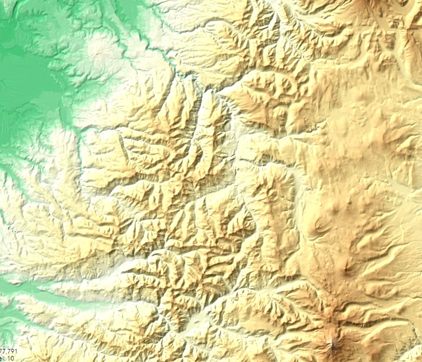
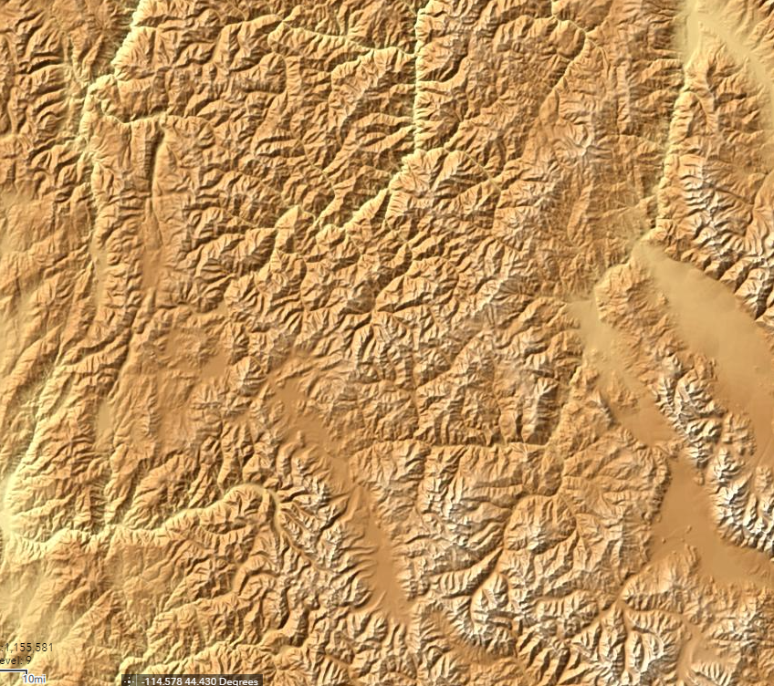
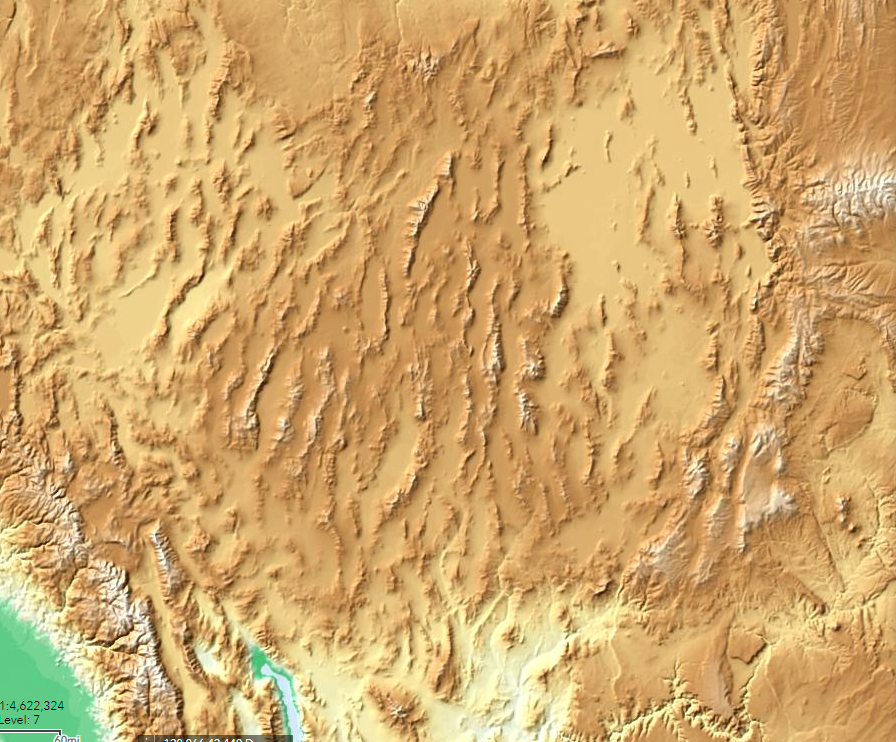
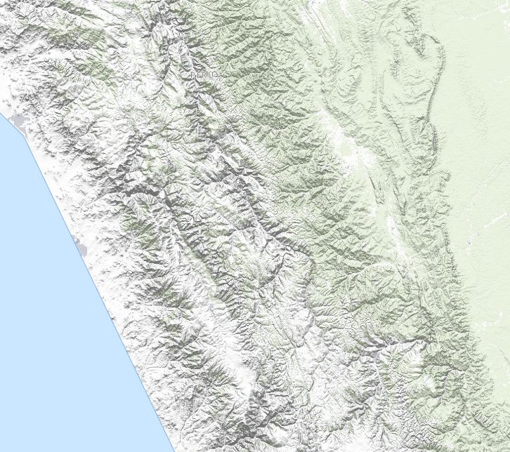
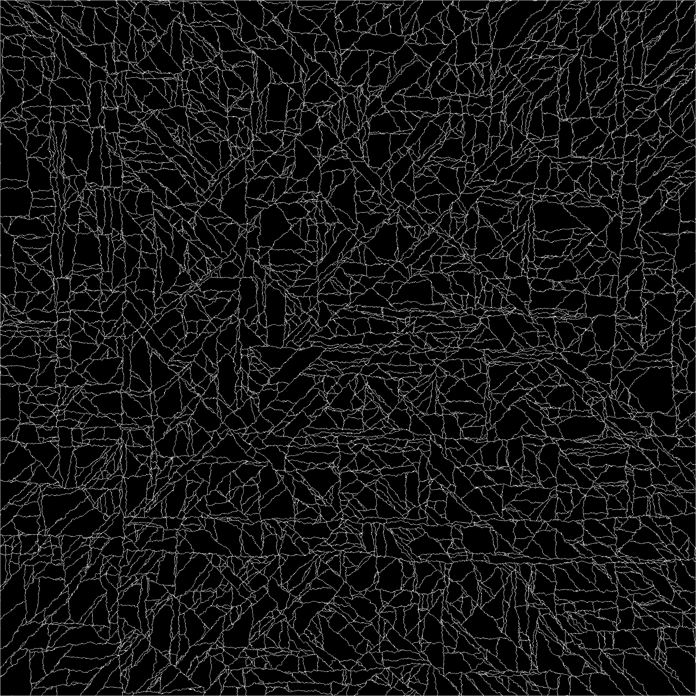
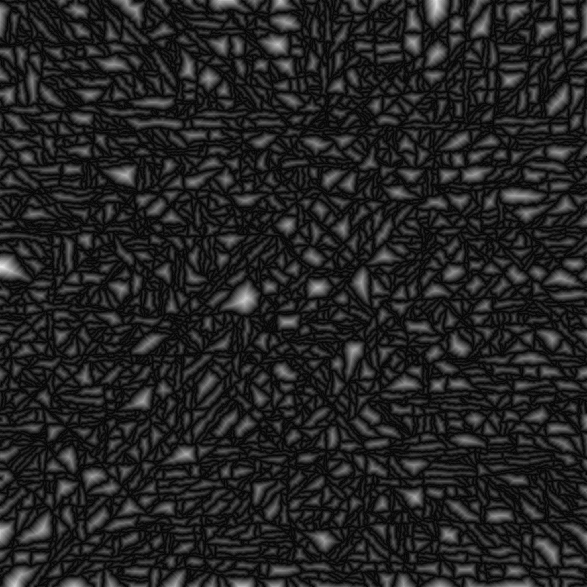
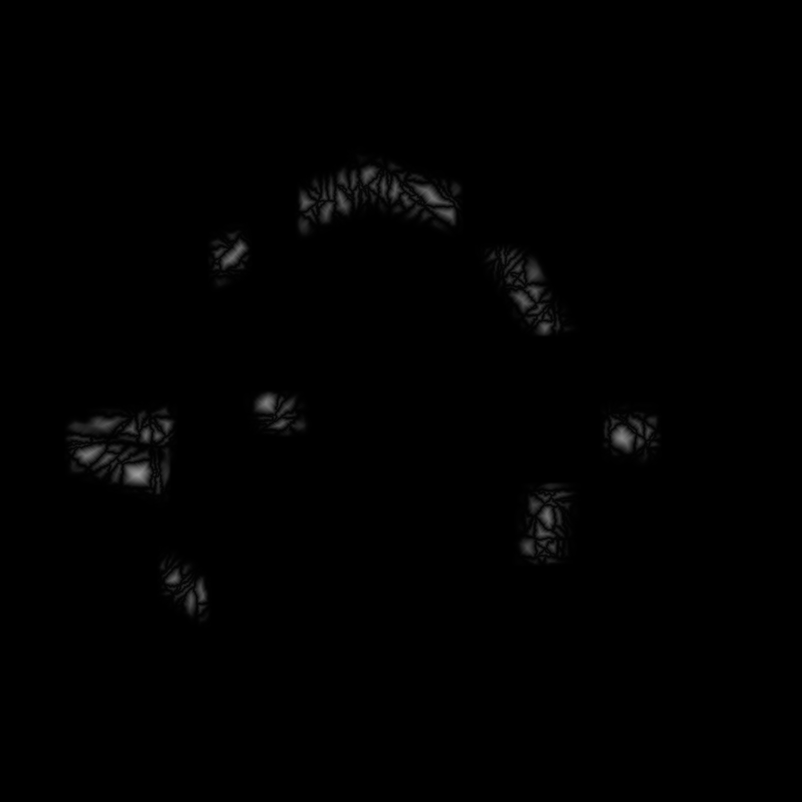
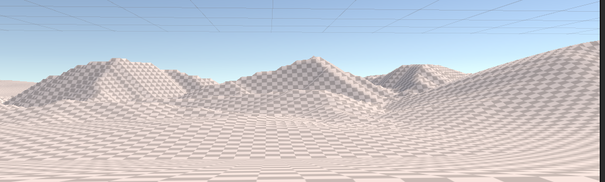

# OK, let's try this again...

So here's the thing:   The mountain algorithms described on the previous page suck.  

They're not generating mountains that are anything like natural.   By layering multiple different erosion methods over top of them, it's possible to get a sort of natural level of "roughness," but there's still this sort of conical nature to them that you don't see in real ones.

Worse, it's the sort of "wrong" that's obvious to a viewer.   If you watch good artists make mountains by hand in a terrain editor, their results invariably have properties that our generated ones do not.   In particular, none of the popular algorithms seem to generate ridges very well, the sort of high connections that make up mountain chains.  If you look at a mountain range edge-on, you don't see each mountain slope descending to a point, then suddenly reversing and rising up the next mountain.  Instead, it's sort of dips-and-rises, often without smooth differentiation of where one mountain ends and another begins.   Some of this is illusion:  mountains behind the first "row" will tend to "fill in" those gaps, but the actual effect is quite real.

A second issue is that most of the standard generation techniques generate particularly picturesque mountains, not your sort of mundane, everyday ones.

So let's start again, and ignore the "known" methods and try to develop our own.

The US Geological survey has tons of elevation maps for the US, and at least rough ones for most of the world.   Let's see what some of our own planet's mountains look like:

## Real Mountains

Here's the Cascade mountains near my home in Oregon:



First off, you don't see many "round cone" mountains there (there are a few on the desert side to the east and south, which in Oregon are probably volcanos).  In fact, if I were describing this, I'd probably say something like "a series of uneven ridges separated by canyons" (most of which are rivers, creeks, or streams if you turn on the water overlays.)  A lot of what we see as a "mountain" is either just a high point on one of these ridges, or the ridge itself viewed edge-on.   It's really, _really_ hard to say what the boundaries of a particular mountain are, here.

Are these typical?  Let's take a look at the northern Rockies, up in Idaho, Montana, and Wyoming:



A key difference here is that these are sharper and taller, although the canyons are actually even denser.   The effect isn't quite as pronounced as these images show, because they're not to the same scale.  The rockies are younger, less eroded mountains.   You may also notice a sort of vertical bias here -- there are more north/south features than east-west ones, both ridges and especially valleys.   That's even more obvious if you look at a much more zoomed out view of the Southeastern United States:



Here we're seeing uplift directly, these are basically the same ridges that you get if you shove a towel into another one on a smooth table.  And it's sort of fractal effect:  On this scale, whole ranges are the "peaks" that get separated by wide valleys (albeit in a more aligned pattern).  Most of that space is the Great American Desert, so there's a lot of erosion going on here, too.

The USGS doesn't have as much detail outside the United States, but here's a shot of Peru (colored differently because different data sets are available there).  These are the Andes, even younger mountains still:



From this, we learn that the coastline of Peru is made up of very, very straight lines (some sort of map artifact).  But inland, we see the multiple "ripples" of tectonic squishing, and the same sort of "long ridges broken up by canyons" model we see elsewhere.  There's a sort of interesting effect here, too:  note that the western (whitish) areas tend to have most of the large canyon features north-south, but the greenish inland areas switch to almost exclusively east-west.

## So where to from here?

If you look at the higher zoom maps (more detail), you notice a fairly recurring pattern:  the elevation rises to a ridge (not usually a point) more or less evenly between each bordering canyon.

So how about skipping the whole "place the mountains and erode them down" idea in favor of "place the canyons and then push up the space between them?"

### First Try at Canyon Algorithm

So here's my proposed solution:

```pseudocode
Create a "canyon map" of boolean values, initialized to "false".  "true" in this map represents the bottom of a canyon.

Determine the overall bounds of our mountain range

Using Midpoint displacement, draw some "edges" to those bounds as canyons.

repeat
    Find a point that's on a canyon
    draw a canyon from that point in a random direction (but not outside)
    if you get to another canyon point, stop N% of the time, always stop on an edge
until we think we have enough canyons

for each pixel on the height map, set it to a height based on how far it is from the nearest canyon.
```

For the "draw a canyon" step, we'll probably want to use a sort of weighted random walk, where each step is more likely to be "forward" than any other direction, but still provides a lot of randomness.     The N% stopping time is based on observation of the real-world maps, where canyons occasionally hit another canyon and still cross it.  This happens fairly rarely, so N might be 95% or so.

#### Random Canyons

This turns out to be surprisingly easy to implement. After playing with it for a bit, I went with generating random-walk canyons for the entire map, and then just sampling it in places where I wanted the mountain ranges to me.

The implementation is just to pick a direction and randomly move toward it most of the time, or slightly to the left or right instead the rest of the time, stopping when we hit another canyon.  (N = 100 for this first pass).   Generating for a whole 2049x2049 vertex heightmap (our Global Terrain Template), I settled on 10K "canyons" after some experimentation.  That gives me a canyon layout like this:



My algorithm tends to prefer axis alignment or 45 degree angles, which is visible when you see the entire mesh like this.   It works for my purposes, but a better random walk would produce less aligned lines.   

From there, we iterate across every pixel repeatedly, assigning all non-assigned surrounding elements a height value of one greater than our current value, resulting in a height map that looks something like this:



Tell me that doesn't look a lot like the image of the Rockies, above!    But the proof is in the rendering.   If we select swaths of this as our mountain ranges and blend them into the current terrain:



We can feed them into the GTT generation, replacing the current mountain rendering and erosion steps:



### Success?

I think that's a pretty good set of mountains.  It looks much more like a real mountain range than the conical shapes we were seeing before. and there are real ridges and a larger variety of shapes.   More interestingly, it's less expensive than our previous mountain algorithm, and the above images are _out of the box_.  We get varying heights, ridges, and erosion for "free."   And zipping around the map a bit to look around, there aren't any "weird" shapes.

It's not perfect:  the edges of the real-world mountain ranges get "looser" as the canyons widen, and right now all of our canyons are all the same depth relative to the overlaid terrain.   We could add some noise for roughness, some options for higher, steeper mountains or smoother, lower ones.   It could use some added erosion to break up those fairly smooth edges.   We'll iterate on it again, but it's good enough at the moment to let us move on to related problems. 

## Mountain Ranges

Our mountain _range_ algorithm can use some work.   The test case above was pretty much just some polygons, blurred at the edges to make them fade out back to the plains (or whatever the baseline terrain is)   They don't look much like ranges, just mountainous "patches" in our world.